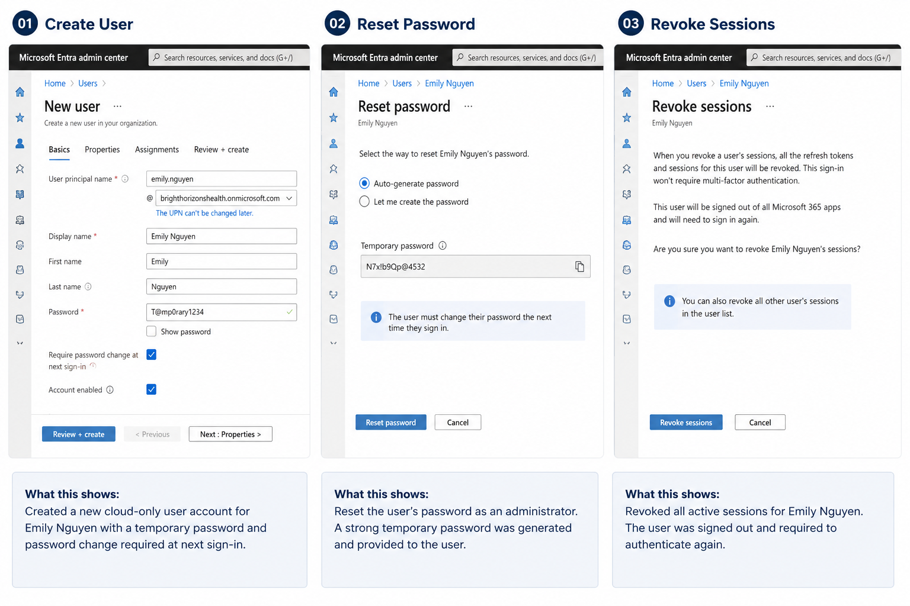
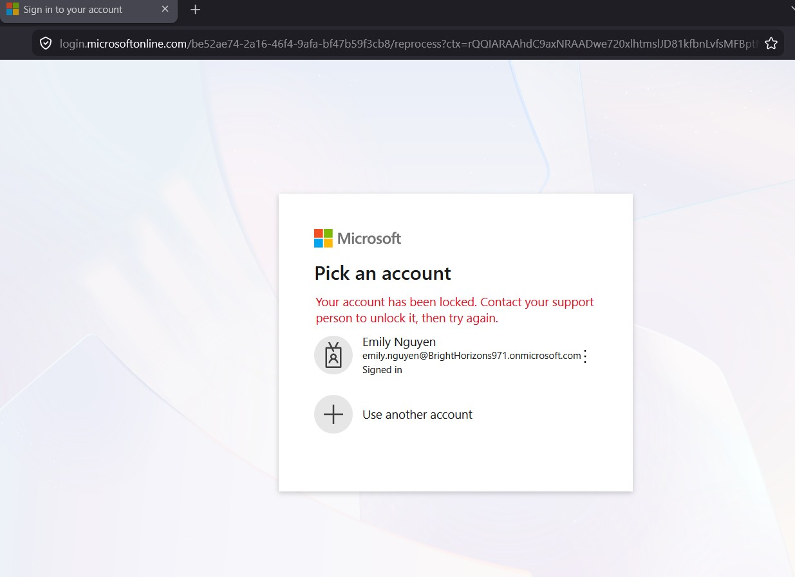

# Project 01 – Microsoft Entra User Lifecycle Management

## Overview

This project demonstrates practical Microsoft Entra ID user lifecycle administration in a small-business lab environment.

The scenario is based on Bright Horizons Health, a fictional small business environment used to practise Microsoft 365 administration tasks.

## Skills Demonstrated

- Created a cloud-only Microsoft Entra ID user
- Applied user naming standards
- Completed first user sign-in
- Forced password change at first sign-in
- Registered Microsoft Authenticator
- Reset a user password as an administrator
- Revoked active user sessions
- Disabled and re-enabled a user account
- Deleted and restored a user account
- Reviewed Sign-in Logs
- Reviewed Audit Logs

## Lab Scenario

A new receptionist, Emily Nguyen, joined Bright Horizons Health.  
As the Microsoft 365 administrator, I provisioned her account, secured it, tested the user experience, and then simulated common identity lifecycle tasks.

## Key Tasks Completed

### 1. User Creation

Created a cloud-only Microsoft Entra ID user for Emily Nguyen.

### 2. First Sign-in and MFA Registration

Signed in as the user, changed the temporary password, and registered Microsoft Authenticator under Security Defaults.

### 3. Password Reset

Reset the user's password as an administrator and confirmed the user could sign in again with a temporary password.

### 4. Revoke Sessions

Revoked the user's active sessions and observed that reauthentication was required after refreshing the browser.

### 5. Disable and Enable Account

Disabled the user account, confirmed sign-in was blocked, then re-enabled the account.

### 6. Delete and Restore Account

Deleted the user account and restored it from Deleted Users.  
After restoration, the password, Microsoft Authenticator registration and group memberships were retained.

### 7. Sign-in Logs

Reviewed successful and failed sign-in events, including authentication status, client application, location and error messages.

### 8. Audit Logs

Reviewed administrative actions such as enabling, deleting and restoring the user account.  
The audit logs showed the actor, target, activity and modified properties.

## Key Lessons Learned

- Sign-in Logs are used to investigate authentication events.
- Audit Logs are used to investigate administrative changes.
- Revoking sessions does not always immediately close an active browser window, but it forces reauthentication when the session is refreshed.
- A soft-deleted user can be restored from Deleted Users.
- In this lab, restoring the user also restored the password, MFA registration and group memberships.
- Administrator actions should be verified through logs rather than assumed.

## Technologies Used

- Microsoft Entra ID
- Microsoft Entra Admin Center
- Microsoft Authenticator
- Security Defaults
- Sign-in Logs
- Audit Logs

## Screenshots

## 1. User Account Administration

This lab began by creating a new cloud-only user account named **Emily Nguyen**. During the creation process, a temporary password was assigned and the user was configured to change the password at the first sign-in.

The account password was then reset by the administrator, and all active user sessions were revoked to force re-authentication and ensure the new credentials were used immediately.

---

## 2. User Unable to Sign In After Account Disable

The user account was disabled from the Microsoft Entra admin center. When Emily attempted to sign in again, Microsoft correctly prevented access and displayed an account locked message.

This demonstrates that disabling a user immediately blocks new authentication attempts without deleting the account.

---

## 3. Investigating Sign-in Logs

The Sign-in Logs were used to investigate authentication activity for the user. The logs showed successful and failed sign-ins, authentication requirements, IP address, client application, browser information and timestamps.

These logs are primarily used to investigate authentication and access-related events.

---

## 4. Investigating Audit Logs

Audit Logs were reviewed to track administrative actions performed on the user account. They recorded operations such as updating the account, disabling the account, deleting the user and restoring the deleted account.

Unlike Sign-in Logs, Audit Logs record **who performed an administrative action, when it occurred, and what object was modified**.

