# Project 02 – Microsoft Entra Group Management

## Project Overview

This project demonstrates the design, configuration and validation of Microsoft Entra ID groups within the fictional **Bright Horizons Health** environment.

The project focused on using Microsoft 365 groups and security groups to support collaboration, access management and administrative efficiency. Both assigned and dynamic membership models were implemented and tested.

Dynamic membership rules were created using user attributes such as department and job title. The project also included rule validation, live attribute-change testing, automated group assignment for a newly created user, and an investigation of group ownership and delegated management.

---

## Business Scenario

Bright Horizons Health has employees working across multiple business areas, including Clinical, Finance, Human Resources, Procurement, Reception and Information Technology.

Manually maintaining group membership would increase administrative effort and create a risk that access becomes outdated when employees join the organisation, change departments or move into management positions.

The organisation therefore required a structured group-management model that could:

- Support collaboration through Microsoft 365 groups
- Support access control through security groups
- Automatically assign users to appropriate groups based on identity attributes
- Reduce repetitive manual administration
- Respond to changes in employee information
- Support delegated group management through group ownership

---

## Project Objectives

- Understand the differences between Microsoft 365 groups and security groups
- Configure groups using consistent naming conventions
- Compare assigned and dynamic membership
- Create department-based dynamic membership rules
- Create a management group using department and job-title attributes
- Validate dynamic membership rules before relying on them
- Verify that users were assigned to the expected groups
- Test how a department change affects dynamic membership
- Test automated group assignment for a newly created employee
- Investigate group ownership and delegated group management
- Document findings and lessons learned

---

## Environment

| Component | Configuration |
|---|---|
| Organisation | Bright Horizons Health |
| Identity platform | Microsoft Entra ID |
| Tenant type | Cloud-based Microsoft Entra tenant |
| Administration portal | Microsoft Entra admin centre |
| User environment | Fictional healthcare organisation |
| Group types | Microsoft 365 groups and security groups |
| Membership types | Assigned and dynamic user membership |
| Dynamic attributes | Department and job title |

---

## Group Design

| Group | Group Type | Membership Model | Purpose |
|---|---|---|---|
| `M365-Clinical` | Microsoft 365 | Dynamic | Collaboration for Clinical employees |
| `M365-Reception` | Microsoft 365 | Dynamic | Collaboration for Reception employees |
| `M365-Procurement` | Microsoft 365 | Dynamic | Collaboration for Procurement employees |
| `M365-HR` | Microsoft 365 | Dynamic | Collaboration for Human Resources employees |
| `M365-Finance` | Microsoft 365 | Assigned | Finance collaboration with manually managed membership |
| `SG_IT_Admins` | Security | Dynamic | Security grouping for IT management personnel |
| `SG_IT_ServiceDesk` | Security | Dynamic | Security grouping for IT employees |
| `SG_Managers` | Security | Dynamic | Organisation-wide management grouping |

Naming convention:

- `M365-` for Microsoft 365 collaboration groups
- `SG_` for security groups

## Microsoft 365 Groups

Microsoft 365 groups are primarily designed to support collaboration. Depending on configuration, they can provide shared email, calendar, SharePoint, Planner and Teams-related resources.

In this project, Microsoft 365 groups were used for departmental collaboration.

---

## Security Groups

Security groups are primarily used to manage access to resources, applications and services.

Rather than assigning permissions separately to individual users, permissions can be assigned to a security group and inherited by its members.
### Group Configuration Evidence

The following screenshots show the configuration of Microsoft 365 and security groups within the Bright Horizons Health tenant.

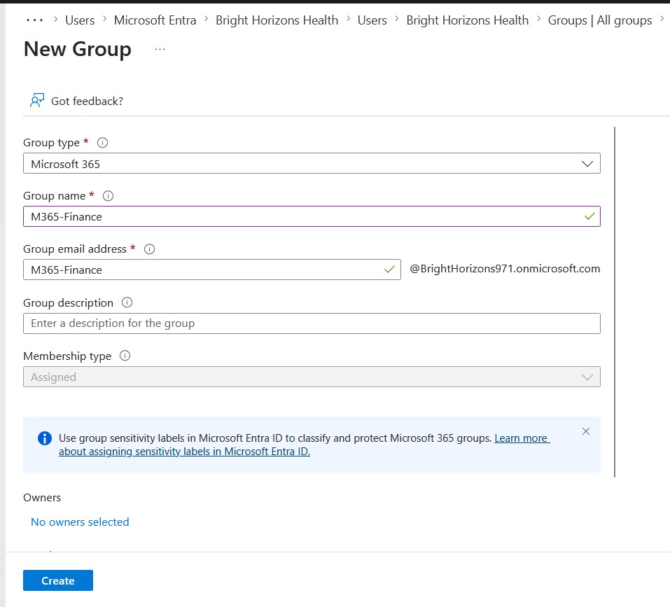

*Figure 1 — Configuration of a Microsoft 365 group for departmental collaboration.*

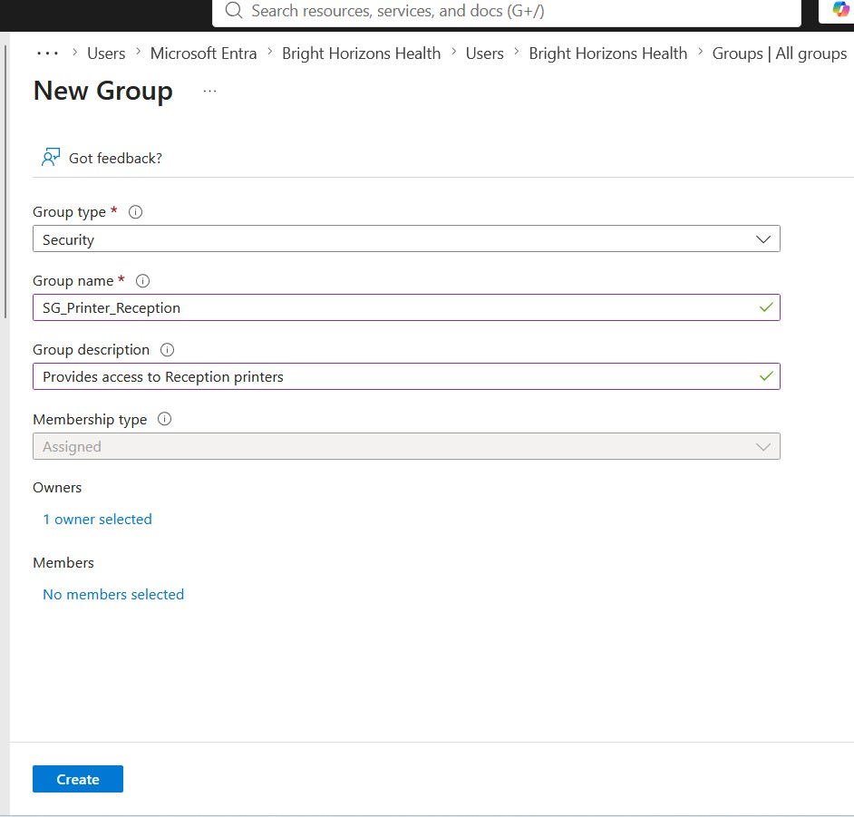

*Figure 2 — Configuration of a security group for access-oriented administration.*

---

## Assigned and Dynamic Membership

### Assigned Membership

With assigned membership, an administrator or authorised group owner manually adds and removes members.

`M365-Finance` was configured with assigned membership, and its Finance users were added manually.

### Dynamic Membership

Dynamic membership automatically evaluates user attributes against a membership rule.

When a user satisfies the rule, Microsoft Entra ID automatically adds the user to the group. If the user no longer satisfies the rule, the user is automatically removed.

---

## Dynamic Membership Rules

Example department-based rule:

```text
(user.department -eq "Clinical")
```

IT Service Desk rule:

```text
(user.department -eq "IT")
```
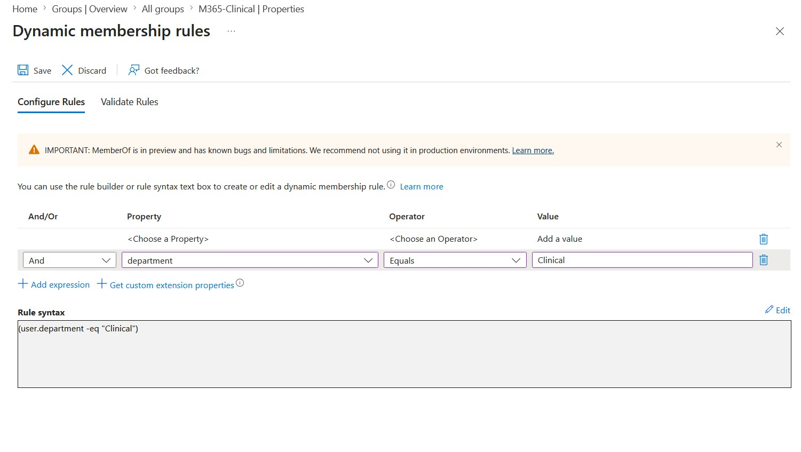

*Figure 3 — Dynamic membership rule using the Department attribute to automate group membership.*

---

## Manager Group Rule

The `SG_Managers` group was designed to include users whose department was Management or whose job title contained the word Manager.

```text
(user.department -eq "Management") or (user.jobTitle -match ".*Manager.*")
```

This avoided listing every possible manager title individually.
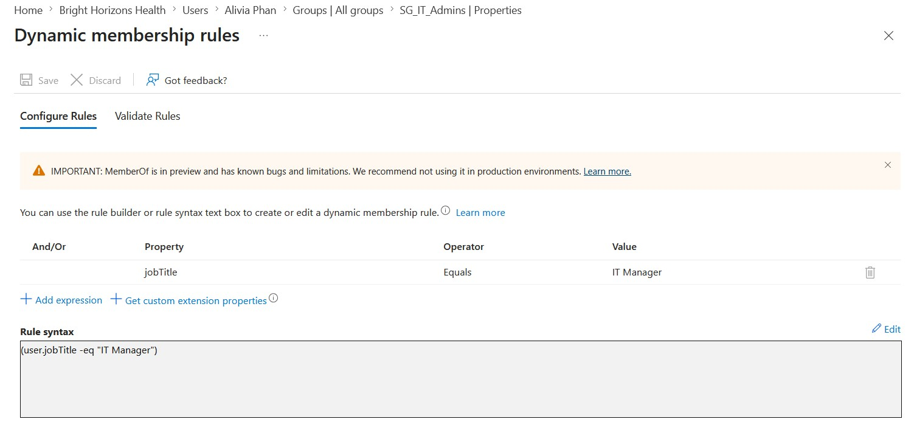

*Figure 4 — Dynamic rule using Department and Job Title attributes to identify management employees.*

---

## Rule Validation

The **Validate Rules** feature was used to test selected users against dynamic membership rules.

Validation confirmed whether a user was expected to be:

- **In group**
- **Not in group**

This was useful before relying on the rule for actual membership processing.
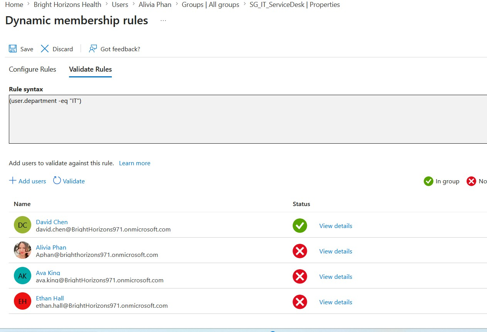

*Figure 5 — Validation of selected users against a dynamic membership rule before relying on membership processing.*

---

## Testing and Validation

### Membership Verification

The configured groups were reviewed to confirm that expected users were present and obvious incorrect members were absent.
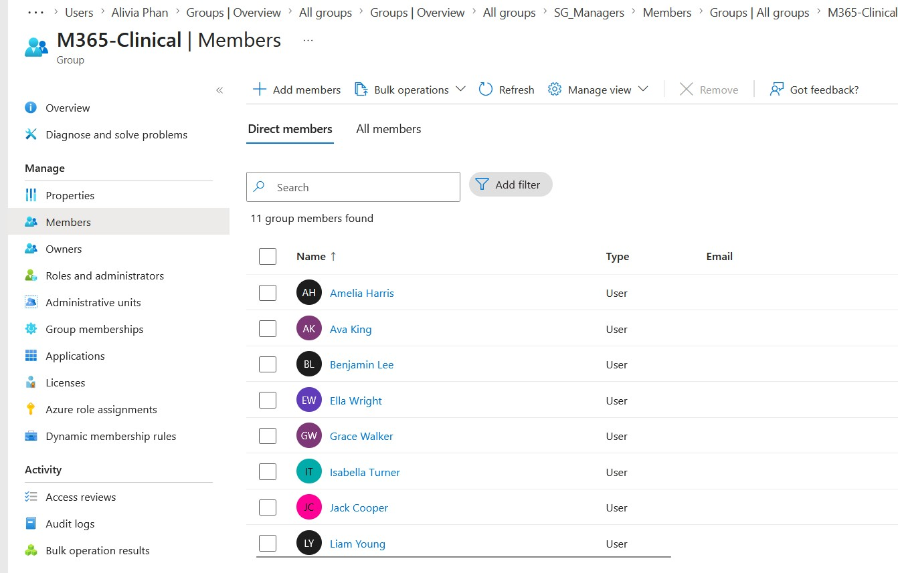

*Figure 6 — Verification that expected Clinical employees were automatically included in the dynamic group.*

### Live Department Change Test

An existing employee initially had:

```text
Department: Clinical
```

The Department attribute was then changed to:

```text
Department: HR
```

After processing, the user was:

- Removed from `M365-Clinical`
- Added to `M365-HR`

This demonstrated an internal mover scenario.
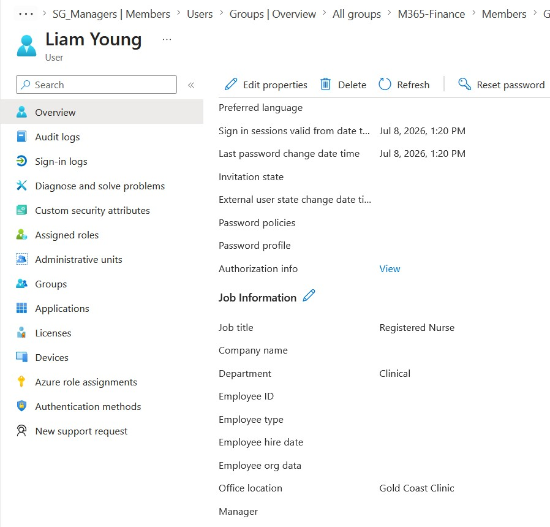

*Figure 7 — User account before the internal-mover test, with Department set to Clinical.*

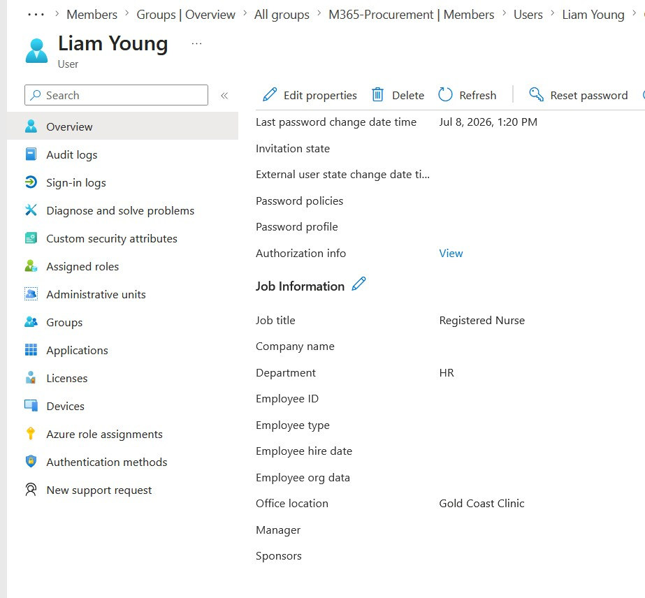


*Figure 8 — The same user after the Department attribute was changed from Clinical to HR.*

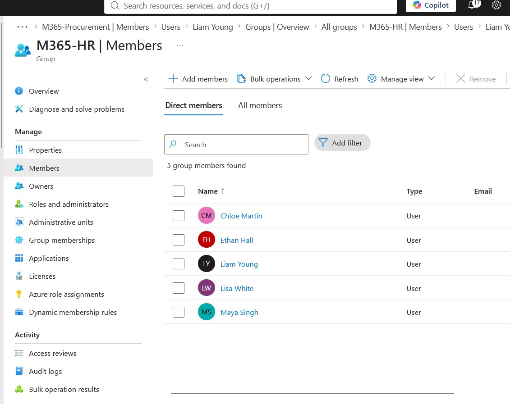

*Figure 9 — Automatic membership of the HR group following the Department attribute change.*

### New User Provisioning Test

A new employee, **Sophia Taylor**, was created with:

```text
Department: Procurement
Job title: Procurement Manager
User type: Member
```

She was automatically added to:

- `M365-Procurement`
- `SG_Managers`

This demonstrated that one identity record could satisfy multiple dynamic rules.
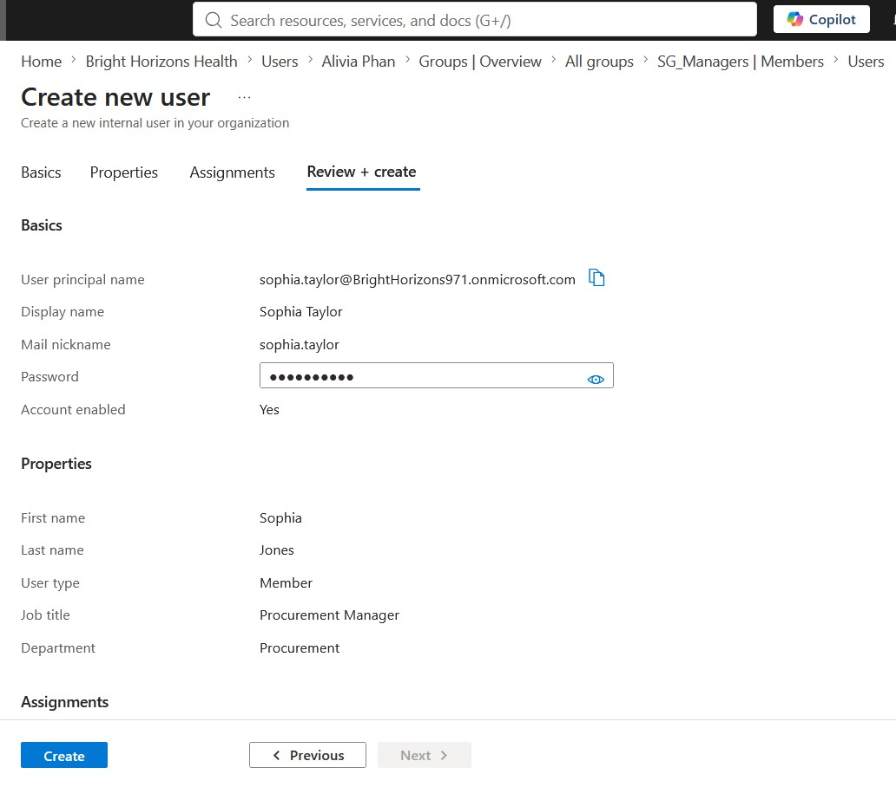

*Figure 10 — Sophia Taylor created with Department set to Procurement and Job Title set to Procurement Manager.*

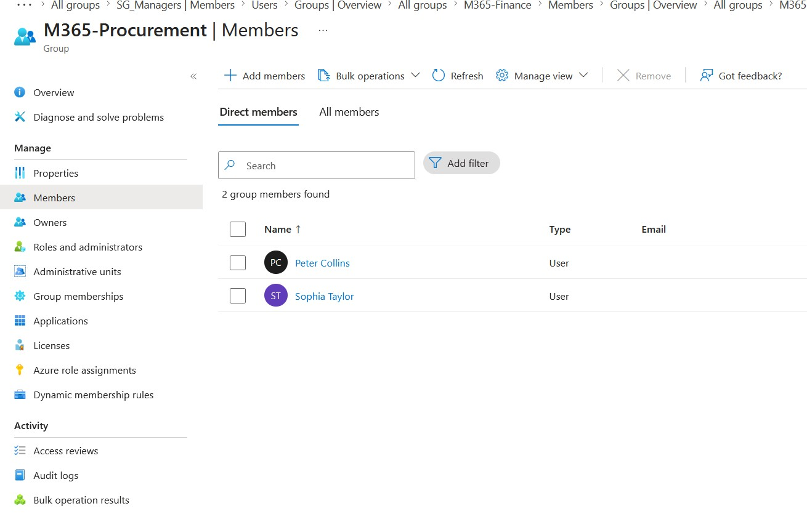

*Figure 11 — Automatic assignment to the Procurement Microsoft 365 group based on the Department attribute.*

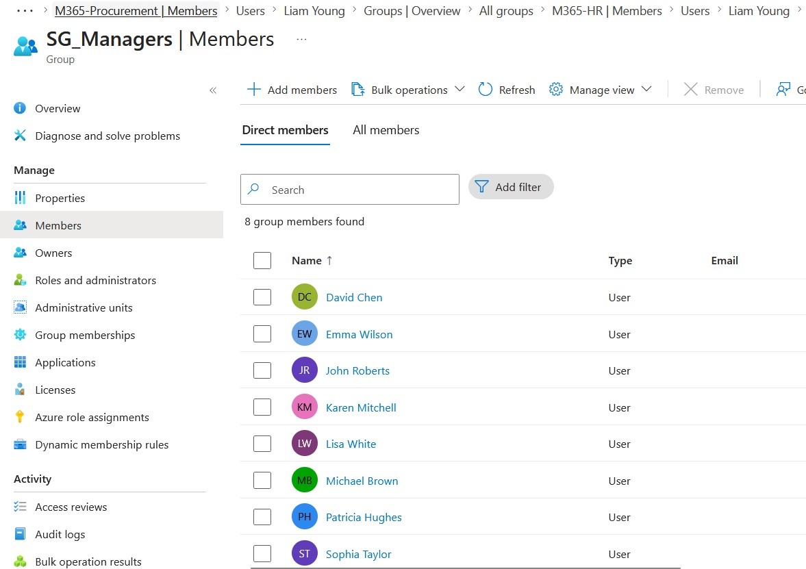

*Figure 12 — Automatic assignment to the Managers security group based on the Job Title rule.*

---

## Group Ownership and Delegated Management

Emily Nguyen was assigned as an owner of:

- `M365-Reception`
- `M365-Finance`

The tests demonstrated that **group ownership and group membership are separate relationships**.

Emily could own `M365-Finance` without being a Finance group member.

For the assigned `M365-Finance` group, Emily could:

- View group details
- Add members
- Remove members
- Promote members to owners
- Review membership
- Edit group information
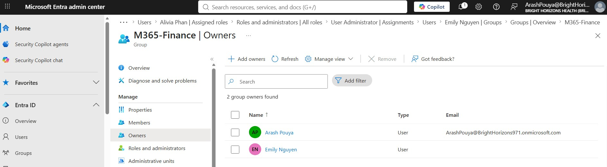

*Figure 13 — Emily Nguyen assigned as an owner of the Microsoft 365 group in the Entra admin centre.*

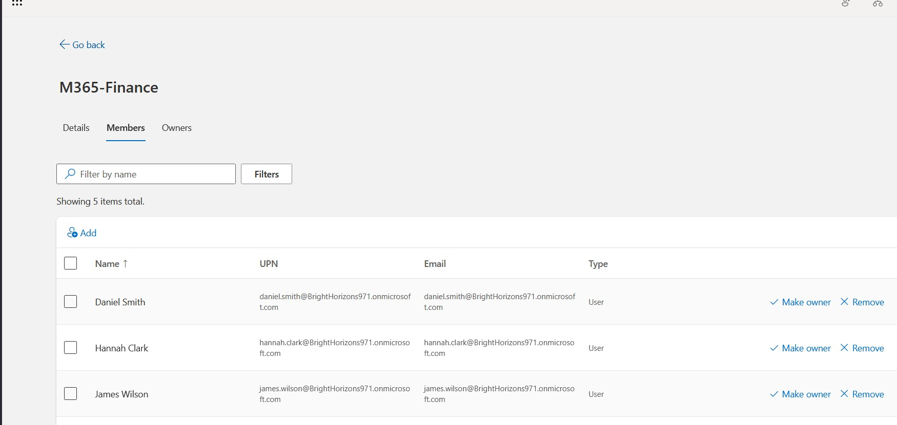

*Figure 14 — Delegated membership controls available to Emily as an owner of the assigned M365-Finance group.*

For the dynamic `M365-Reception` group, membership remained controlled by the dynamic rule and user attributes.
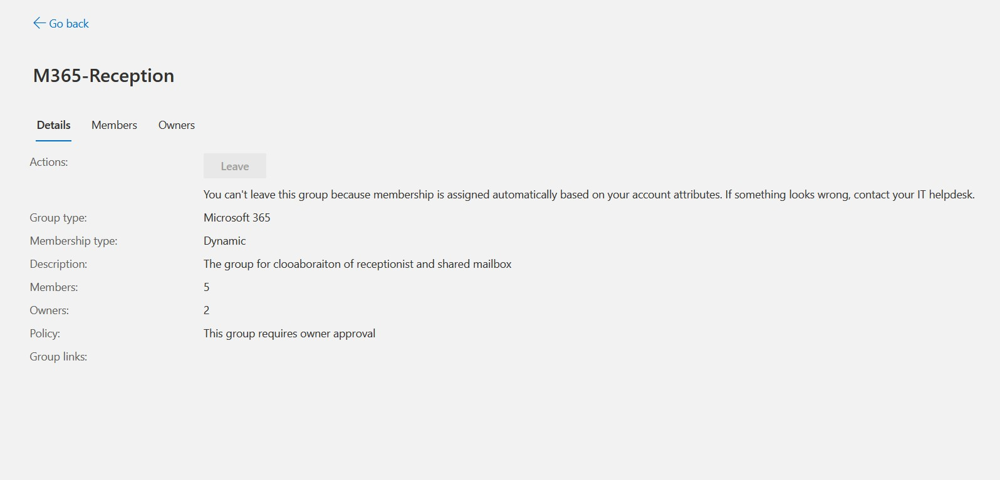

*Figure 15 — Owner view of the dynamic M365-Reception group, where membership remains controlled by the dynamic rule.*
The owner portal also displayed options for reviewing group requests and expiring groups. These features were observed, but the complete request workflow was not tested.

---

## Key Findings

- Microsoft 365 groups are primarily collaboration-focused.
- Security groups are primarily used for access and permissions.
- Assigned groups require direct membership administration.
- Dynamic groups automate membership using identity attributes.
- Accurate Department and Job Title values are essential.
- A single user can satisfy multiple dynamic membership rules.
- Attribute changes can automatically move users between groups.
- Rule validation helps test expected outcomes.
- Group ownership can delegate management without broad tenant-wide roles.
- Ownership and membership are separate relationships.
- Owners can directly manage assigned-group membership.
- Dynamic membership remains controlled by rules and attributes.

---

## Challenges and Troubleshooting

### Dynamic Membership Processing

Some changes took time to appear, while later tests were reflected almost immediately.

### Rule Builder Limitations

The rule syntax editor was used where the visual rule builder did not clearly represent advanced syntax.

### Attribute Quality

Inconsistent or missing identity attributes can lead to incorrect membership.

### Group Request Workflow

The owner portal showed group-request functionality, but a complete requester-side workflow was not available in the current lab configuration.

---

## Skills Demonstrated

- Microsoft Entra ID group administration
- Microsoft 365 group configuration
- Security group configuration
- Assigned and dynamic membership
- Department-based and job-title-based rules
- Regular-expression matching
- Dynamic rule validation
- Membership verification
- Joiner and mover testing
- Automated group assignment
- Group ownership
- Delegated group administration
- Troubleshooting
- Technical documentation

---

## Lessons Learned

Dynamic group management depends heavily on accurate and consistently maintained identity information.

The project showed how user attributes can automate collaboration and access decisions, how attribute changes can automatically alter membership, and how ownership can delegate group administration without granting broad tenant-wide permissions.

---

## Project Outcome

Project 02 successfully demonstrated the design, configuration and validation of Microsoft Entra group management in a simulated organisational environment.

The project implemented Microsoft 365 and security groups, compared assigned and dynamic membership, validated identity-driven automation, tested user changes, confirmed automated membership for a new employee, and investigated delegated group ownership.

The completed environment provides a foundation for future work with administrative roles, RBAC, authentication, Conditional Access and broader Entra governance.
