# Project 03 – Microsoft Entra Administrative Roles & RBAC

## Project Overview

This project demonstrates the implementation, testing and validation of Microsoft Entra administrative roles within the fictional **Bright Horizons Health** environment.

The project investigated Microsoft's Role-Based Access Control (RBAC) model by comparing several built-in administrator roles, validating their capabilities through practical testing, and implementing delegated administration using Administrative Units.

Rather than simply assigning administrator roles, this project focused on understanding the principle of least privilege, effective permissions, administrative scope, and how enterprise organisations can safely delegate administrative responsibilities without granting unnecessary tenant-wide access.

---

## Business Scenario

Bright Horizons Health operates multiple clinics across Queensland, including Brisbane Head Office and several regional locations.

As the organisation grows, relying on a small number of Global Administrators to perform every administrative task becomes inefficient and introduces unnecessary security risk.

The organisation therefore requires a role-based administration model that can:

- Delegate routine administrative tasks without granting Global Administrator privileges
- Apply the Principle of Least Privilege
- Restrict administrators to managing only their own business area
- Reduce the impact of compromised privileged accounts
- Improve operational efficiency while maintaining security
- Support future organisational growth across multiple clinic locations

Microsoft Entra Role-Based Access Control (RBAC) and Administrative Units provide the foundation for achieving these objectives.

---

## Project Objectives

- Understand Microsoft Entra built-in administrator roles
- Compare Helpdesk Administrator, User Administrator and Global Reader
- Validate the capabilities and limitations of each role
- Understand effective permissions
- Investigate role scope and delegated administration
- Configure Administrative Units
- Assign Administrative Unit-scoped administrator roles
- Validate scoped administration through practical testing
- Review RBAC and Least Privilege best practices
- Document findings and lessons learned

---

## Environment

| Component | Configuration |
|---|---|
| Organisation | Bright Horizons Health |
| Identity platform | Microsoft Entra ID |
| Tenant type | Cloud-based Microsoft Entra tenant |
| Administration portal | Microsoft Entra admin centre |
| Administrative model | Role-Based Access Control (RBAC) |
| Administrative scope | Tenant-wide and Administrative Unit scoped |
| Administrative Unit | Gold Coast Clinic |

---

## Microsoft Entra Role-Based Access Control (RBAC)

Microsoft Entra ID uses Role-Based Access Control (RBAC) to determine which administrative actions users are permitted to perform.

Rather than granting every administrator unrestricted access, RBAC assigns permissions through predefined administrative roles. Each role contains a specific collection of permissions designed for a particular administrative function.

This allows organisations to delegate administrative responsibilities while reducing unnecessary privileged access.

Throughout this project, practical testing was used to validate the capabilities and limitations of several commonly used built-in administrator roles.

---

## Administrative Role Investigation

Microsoft Entra provides many built-in administrative roles, each designed for a specific management function.

The available roles were reviewed before selecting several commonly used roles for detailed testing.

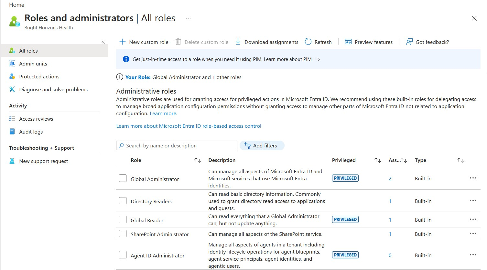

*Figure 1 — Microsoft Entra built-in administrator roles available within the Bright Horizons Health tenant.*

The investigation focused on three roles commonly encountered in enterprise environments:

- Helpdesk Administrator
- User Administrator
- Global Reader

These roles provide an effective comparison between limited administration, identity management, and read-only tenant visibility.

---

## Helpdesk Administrator

The Helpdesk Administrator role is intended for service desk staff who perform routine identity support tasks such as password resets for standard users.

To investigate its capabilities, the Helpdesk Administrator role was assigned to Liam.

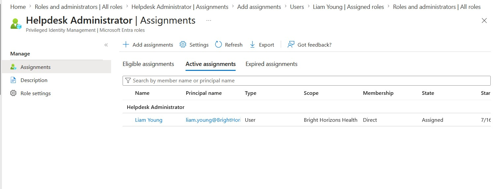

*Figure 2 — Assigning the Helpdesk Administrator role to Liam.*

Several administrative tasks were then tested to determine which operations were permitted.

The first validation confirmed that the Helpdesk Administrator role could **not** create new users.

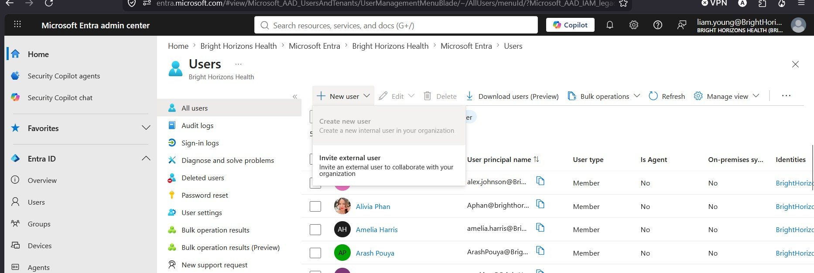

*Figure 3 — The Helpdesk Administrator role does not have permission to create new user accounts.*

Additional testing showed that Helpdesk Administrator also could not reset the password of a Global Administrator.

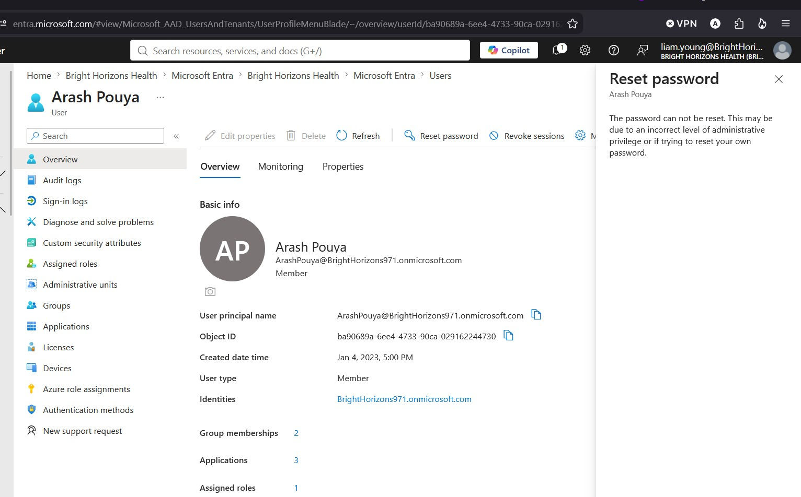

*Figure 4 — Password reset for a Global Administrator was correctly denied.*

These tests demonstrate Microsoft's implementation of the Principle of Least Privilege. Although Helpdesk Administrators can perform routine support tasks, highly privileged accounts remain protected from lower-level administrative roles.

---

## User Administrator

The User Administrator role provides broader identity management capabilities than Helpdesk Administrator while still remaining significantly less privileged than Global Administrator.

To investigate its capabilities, Liam was assigned the User Administrator role.

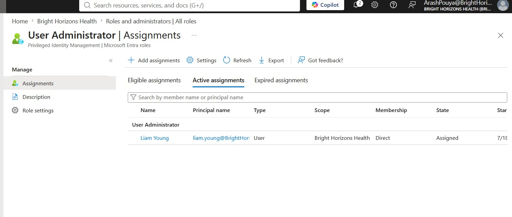

*Figure 5 — Liam assigned the User Administrator role.*

Testing confirmed that User Administrator could successfully create and manage standard user accounts.

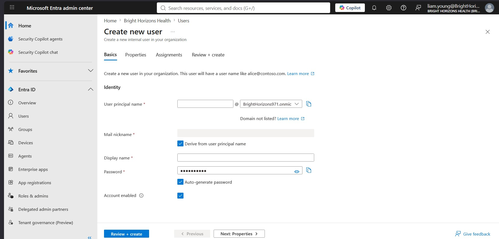

*Figure 6 — User Administrator successfully managing standard user accounts.*

Although User Administrator has considerably broader permissions than Helpdesk Administrator, testing confirmed that it still could not reset the password of a Global Administrator.

*Figure 7 — Administrative boundaries remain in place for highly privileged accounts.*

This demonstrates that Microsoft separates routine identity administration from highly privileged tenant administration, reducing the likelihood that lower-level administrative accounts could compromise the tenant.

---

## Global Reader

Unlike Helpdesk Administrator and User Administrator, the Global Reader role is designed for users who require visibility across the Microsoft Entra tenant without the ability to make configuration changes.

This role is commonly assigned to auditors, security personnel and managers who need to review configurations, users and reports while ensuring that administrative changes remain restricted to authorised personnel.

To demonstrate this capability, Liam was assigned the Global Reader role.

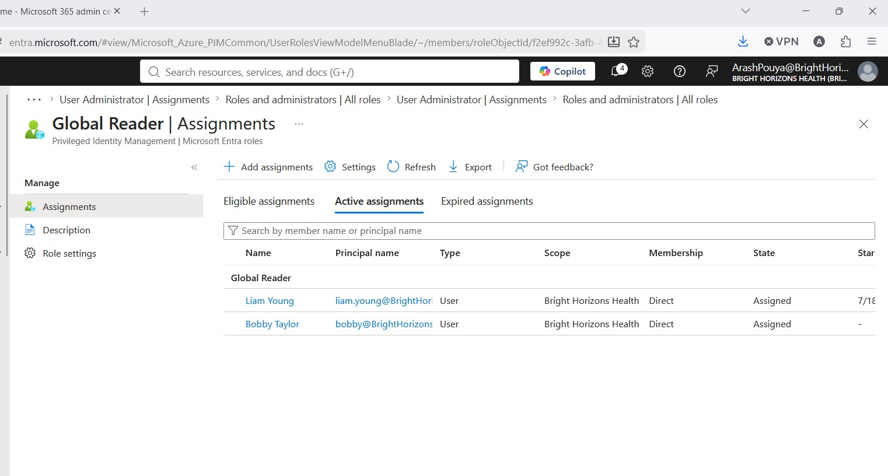

*Figure 8 — Liam assigned the Global Reader role.*

Testing confirmed that Global Reader provides extensive read-only visibility throughout the tenant while preventing configuration changes.

This separation between visibility and administration supports the Principle of Least Privilege by allowing administrators to monitor and audit the environment without introducing unnecessary risk.

---

## Administrative Units

As organisations grow, administrators often need responsibility for only a specific office, department or geographical location rather than the entire tenant.

Microsoft Entra Administrative Units provide a mechanism for delegating administration to a defined subset of users or devices.

To demonstrate this capability, an Administrative Unit was created for the Gold Coast Clinic.

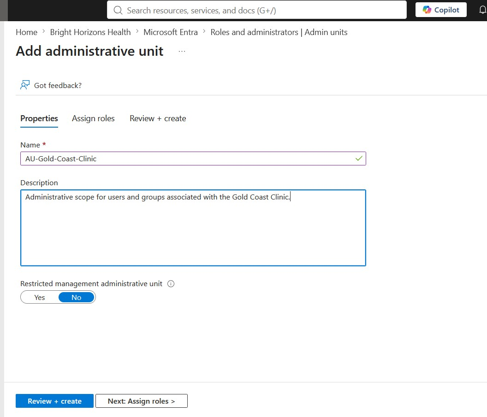

*Figure 9 — Creation of the Gold Coast Clinic Administrative Unit.*

Users belonging to the Gold Coast Clinic were then assigned as members of the Administrative Unit.

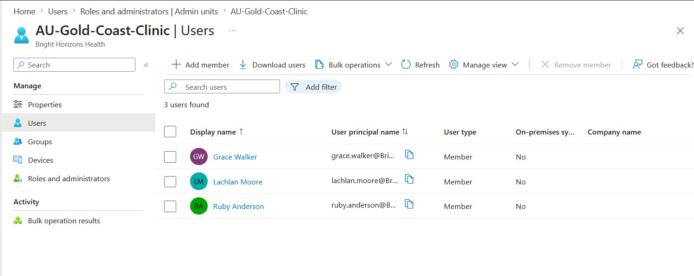

*Figure 10 — Users assigned to the Gold Coast Administrative Unit.*

Unlike security groups or Microsoft 365 groups, Administrative Units do not provide collaboration features or access permissions.

Instead, they define the scope within which delegated administrators can perform administrative tasks.

---

## Scoped Administration

To demonstrate delegated administration, Liam was assigned the **User Administrator** role scoped only to the Gold Coast Administrative Unit.

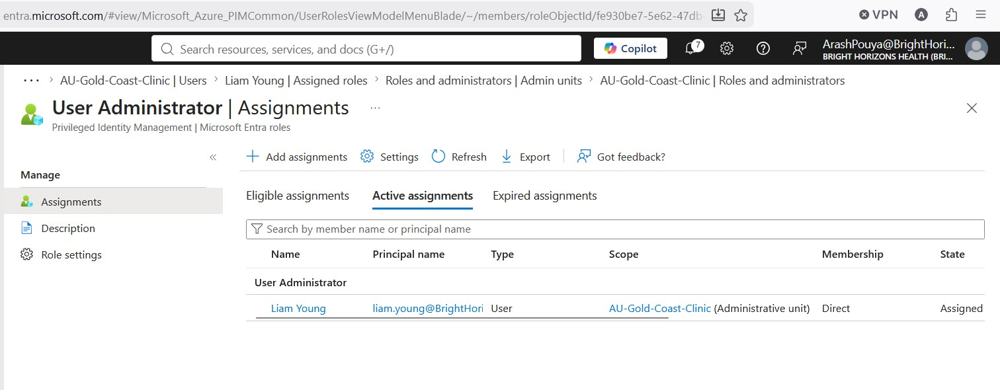

*Figure 11 — User Administrator assigned only within the Gold Coast Administrative Unit.*

Liam already held the tenant-wide **Global Reader** role.

His effective permissions therefore became:

- Tenant-wide read-only access through Global Reader.
- User administration permissions limited to users within the Gold Coast Administrative Unit.

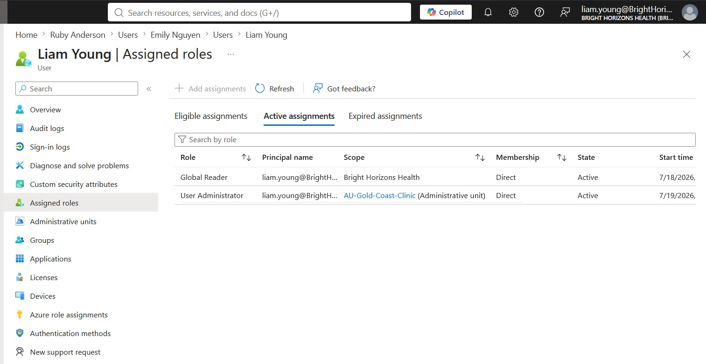

*Figure 12 — Liam's effective permissions resulting from multiple role assignments.*

This demonstrates an important RBAC concept.

A user's effective permissions are determined by the combination of all assigned roles together with their administrative scope.

In other words, permissions are cumulative rather than replaced by newer assignments.

---

## Validation of Scoped Administration

Practical testing was performed to confirm that Liam's administrative permissions were correctly restricted by the Administrative Unit.

Ruby Anderson was a member of the Gold Coast Administrative Unit.

Testing confirmed that Liam could successfully perform User Administrator tasks for Ruby, including password reset and account management.

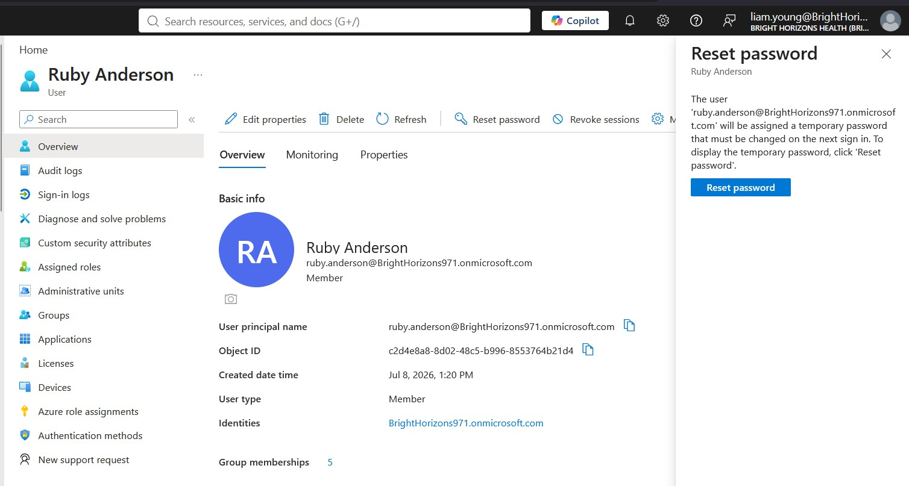

*Figure 13 — Liam successfully administering a user within the Gold Coast Administrative Unit.*

Emily Nguyen was not a member of the Gold Coast Administrative Unit.

Although Liam still had tenant-wide visibility through the Global Reader role, attempts to perform User Administrator actions on Emily were denied.

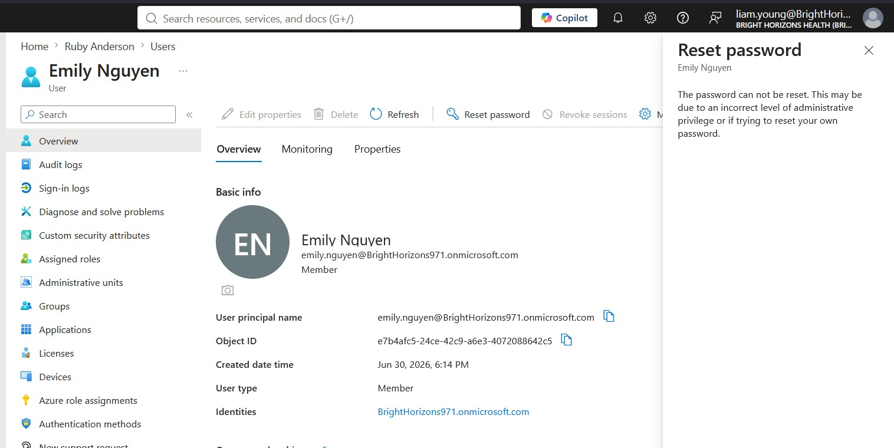

*Figure 14 — Administrative actions correctly denied for a user outside the Administrative Unit.*

These validation tests confirmed that Administrative Units successfully restrict delegated administration to the defined organisational scope.

An important observation from this project is that **Administrative Units do not partition the Microsoft Entra directory itself; they partition administrative authority.**

All users remain within the same tenant. What changes is the scope within which delegated administrators are authorised to perform management tasks.

---

## Validation Results

| Test | Expected Result | Actual Result | Status |
|------|-----------------|---------------|:------:|
| Helpdesk Administrator can create users | No | Confirmed | ✅ |
| Helpdesk Administrator can reset Global Administrator passwords | No | Confirmed | ✅ |
| User Administrator can create users | Yes | Confirmed | ✅ |
| User Administrator can reset Global Administrator passwords | No | Confirmed | ✅ |
| Global Reader can modify users | No | Confirmed | ✅ |
| User Administrator scoped to Administrative Unit can manage Ruby Anderson | Yes | Confirmed | ✅ |
| User Administrator scoped to Administrative Unit can manage Emily Nguyen | No | Confirmed | ✅ |

The practical testing performed throughout this project confirmed that Microsoft Entra RBAC behaves consistently with Microsoft's security model and the Principle of Least Privilege.

Rather than relying solely on documentation, each capability was validated through hands-on experimentation within the Bright Horizons Health environment.

---

## RBAC and Least Privilege Best Practices

Microsoft Entra Role-Based Access Control provides a flexible framework for assigning administrative responsibilities while reducing unnecessary privileged access. Based on the practical work completed in this project, the following practices are recommended for production environments.

### Apply the Principle of Least Privilege

Administrative roles should provide only the permissions required to perform a specific job. Users should never receive broader permissions simply because it is more convenient.

### Minimise Global Administrator Accounts

Global Administrator is the most privileged role within Microsoft Entra. Organisations should maintain only a small number of permanent Global Administrator accounts, reserving them for senior administrators and emergency access.

### Separate Daily and Privileged Accounts

Administrators should use standard user accounts for everyday activities such as email and collaboration, and separate privileged accounts only when administrative tasks are required. This reduces the exposure of highly privileged credentials.

### Delegate Administration Using Administrative Units

Where organisations operate across multiple locations, departments or business units, Administrative Units provide an effective mechanism for delegating administration while limiting the scope of authority.

### Assign Roles to Groups Where Appropriate

Rather than assigning administrative roles directly to individual users, organisations can assign roles to security groups and manage membership through established administrative processes. This simplifies ongoing administration and improves consistency.

### Review Administrative Assignments Regularly

Administrative roles should be reviewed periodically to ensure that privileged access remains appropriate and reflects current business responsibilities.

---

## Key Findings

- Microsoft Entra provides a wide range of built-in administrative roles designed for specific operational responsibilities.
- Helpdesk Administrator supports routine identity support while protecting highly privileged accounts.
- User Administrator provides broader identity management without granting full tenant administration.
- Global Reader enables tenant-wide visibility without configuration permissions.
- Administrative scope is as important as administrative role.
- Effective permissions are determined by the combination of assigned roles and their scope.
- Administrative Units provide secure delegated administration for defined organisational areas.
- Administrative Units do not partition the directory; they partition administrative authority.
- Practical validation is essential for understanding the real behaviour of administrative roles.

---

## Production Considerations

The Bright Horizons Health environment used throughout this project represents a simplified demonstration of enterprise administration. In a production environment, additional governance and security controls would typically be implemented.

Examples include:

- Microsoft Entra Privileged Identity Management (PIM)
- Multi-Factor Authentication for privileged accounts
- Conditional Access policies
- Break-glass emergency administrator accounts
- Administrative role assignment through security groups
- Regular auditing of privileged activity
- Periodic access reviews
- Identity Governance processes
- Administrative Unit design aligned with organisational structure

These controls reduce operational risk while maintaining secure delegated administration across large organisations.

---

## Skills Demonstrated

This project demonstrates practical experience with:

- Microsoft Entra ID administration
- Role-Based Access Control (RBAC)
- Built-in administrator roles
- Administrative Units
- Delegated administration
- Effective permissions
- Administrative scope
- Principle of Least Privilege
- Identity governance concepts
- Security validation
- Technical documentation

---

## Lessons Learned

This project demonstrated that understanding administrative roles requires more than simply assigning permissions. Practical testing revealed how Microsoft Entra combines administrative roles with administrative scope to produce a user's effective permissions.

One of the most significant findings was the distinction between tenant-wide administration and delegated administration through Administrative Units. Although all users remain within the same Microsoft Entra tenant, Administrative Units successfully limit where delegated administrators can exercise their authority.

The project also reinforced the importance of validating expected behaviour through practical experimentation rather than relying solely on product documentation. Performing real administrative tasks provided a much deeper understanding of Microsoft's RBAC implementation and how it supports secure enterprise identity management.

---

## Project Outcome

Project 03 successfully demonstrated the implementation, testing and validation of Microsoft Entra administrative roles within a simulated organisational environment.

The project compared the capabilities of Helpdesk Administrator, User Administrator and Global Reader, investigated effective permissions, implemented Administrative Units and validated delegated administration using practical testing.

The completed environment demonstrates how Microsoft Entra RBAC enables organisations to delegate administrative responsibilities securely while supporting the Principle of Least Privilege.

Together with the previous projects covering user lifecycle management and group management, this project establishes a strong foundation for the next stages of Microsoft Entra administration, including authentication, Conditional Access, device management and Microsoft Intune.
