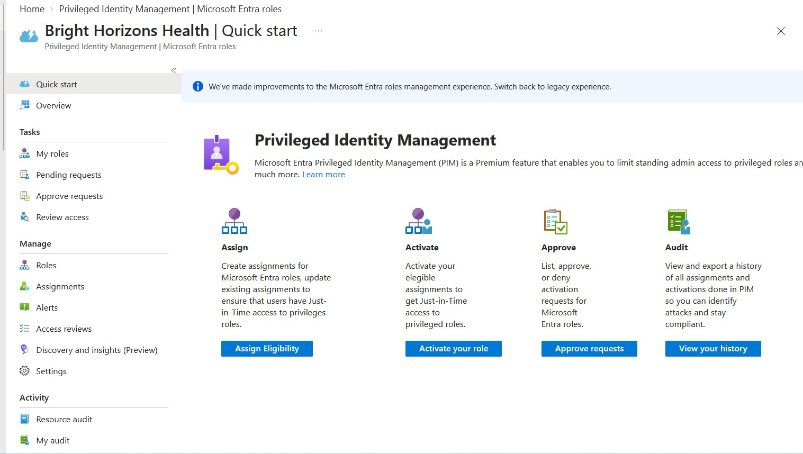
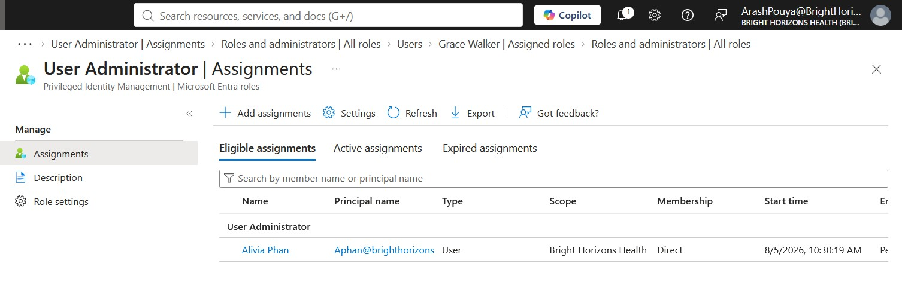
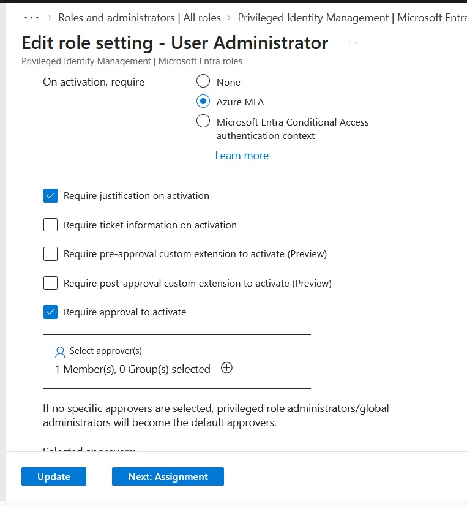
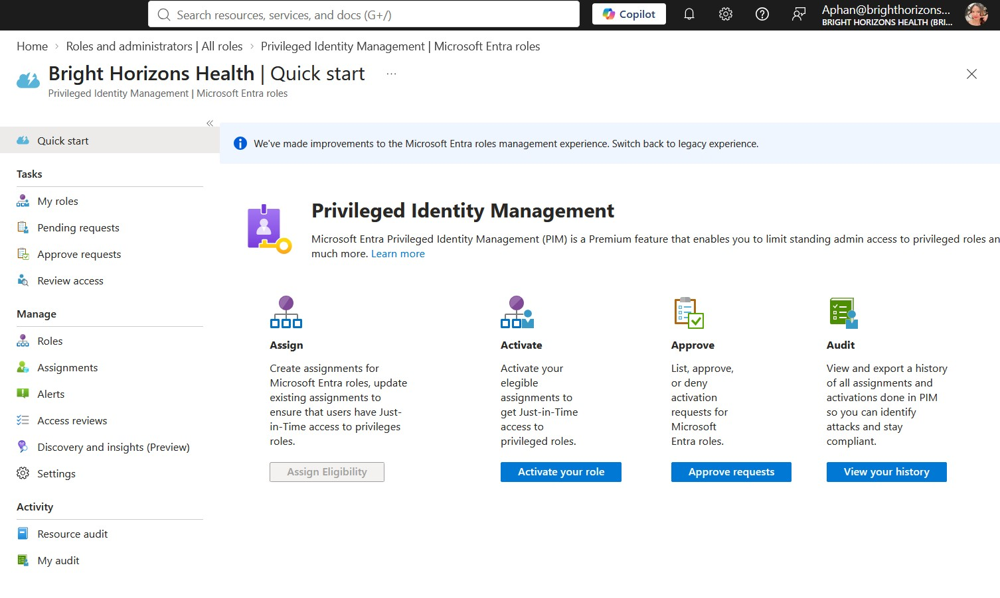
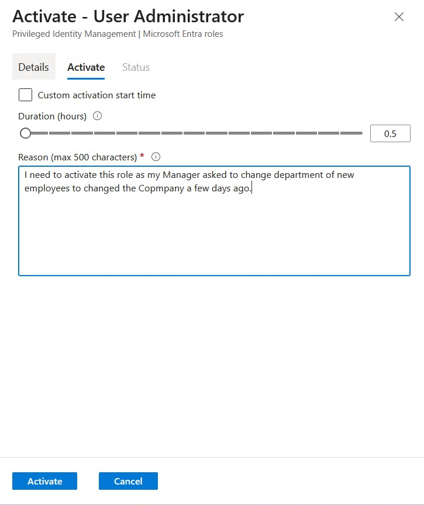
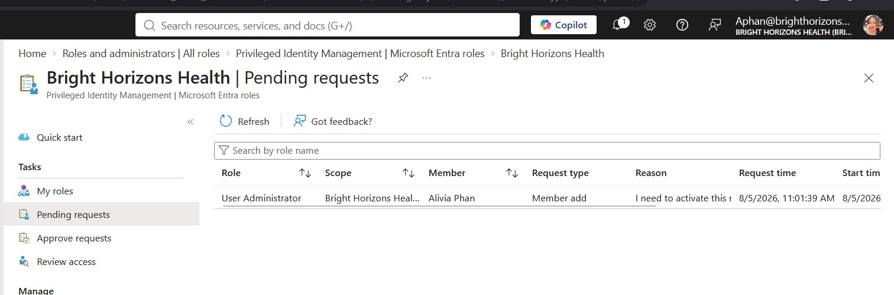
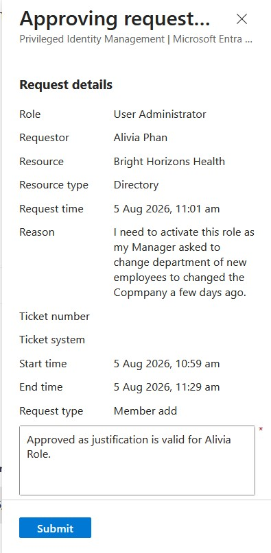
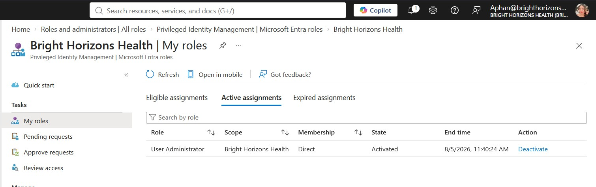
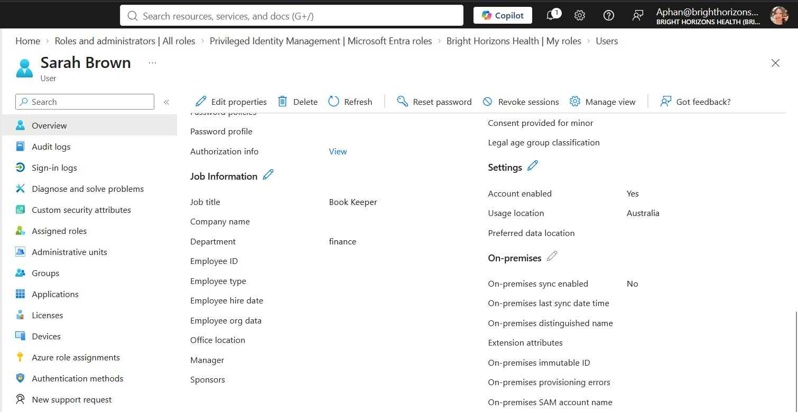

# Project 07 – Microsoft Entra Privileged Identity Management (PIM)

## Project Overview

This project demonstrates the implementation, configuration, testing and validation of Microsoft Entra Privileged Identity Management (PIM) within the fictional **Bright Horizons Health** environment.

Unlike traditional administrator role assignments that provide permanent privileged access, Microsoft Entra PIM enables organisations to implement **Just-In-Time (JIT) administration**, allowing privileged roles to be activated only when required and automatically removed after the administrative task has been completed.

Throughout this project, privileged access was managed using eligible role assignments, activation policies, approval workflows and audit logging. Practical testing was performed to validate the complete lifecycle of a privileged role, from assignment and activation through to approval, temporary administrative access, automatic expiration and auditing.

Rather than simply configuring PIM, this project focused on understanding how organisations can reduce privileged access, strengthen identity security and support Microsoft's Zero Trust security model.

---

# Business Scenario

Bright Horizons Health operates multiple clinics across Queensland and supports a growing number of clinical, administrative and IT staff.

Historically, User Administrator permissions were assigned permanently to IT support personnel responsible for routine identity management tasks such as updating user information, managing departments and supporting employee lifecycle processes.

Although this approach simplified administration, it also introduced unnecessary security risk by allowing privileged accounts to remain active even when administrative work was not being performed.

To reduce privileged exposure and better align with security best practices, Bright Horizons Health decided to implement Microsoft Entra Privileged Identity Management (PIM).

The organisation's objectives were to:

- Eliminate unnecessary permanent administrator privileges.
- Introduce Just-In-Time (JIT) administration.
- Require Multi-Factor Authentication (MFA) before privileged access is granted.
- Require business justification for privileged role activation.
- Require managerial approval before activating sensitive administrative roles.
- Automatically remove privileged access after a defined activation period.
- Maintain a complete audit trail of privileged activities.

This project demonstrates the implementation and validation of these controls using the User Administrator role.

---

# Project Objectives

- Understand Microsoft Entra Privileged Identity Management (PIM)
- Understand permanent versus eligible administrator assignments
- Configure Microsoft Entra PIM
- Configure User Administrator activation policies
- Require Multi-Factor Authentication (MFA)
- Require business justification during activation
- Configure an approval workflow for role activation
- Assign an eligible User Administrator role
- Activate privileged access through Just-In-Time administration
- Approve activation requests as Global Administrator
- Validate temporary administrative permissions
- Confirm automatic role expiration
- Review Microsoft Entra audit logs
- Understand production best practices for privileged administration

---

# Environment

| Component | Configuration |
|-----------|---------------|
| Organisation | Bright Horizons Health |
| Identity Platform | Microsoft Entra ID |
| Tenant Type | Cloud-only Microsoft Entra tenant |
| Administration Portal | Microsoft Entra Admin Center |
| Identity Governance | Microsoft Entra Privileged Identity Management |
| Administrative Role | User Administrator |
| Eligible User | Alivia Phan |
| Approver | Grace Walker (Global Administrator) |

---

# What is Privileged Identity Management (PIM)?

Microsoft Entra Privileged Identity Management (PIM) is an Identity Governance capability that enables organisations to control, monitor and audit privileged administrator access.

Rather than assigning administrator roles permanently, PIM allows users to receive **eligible assignments** that can only be activated when administrative work is required.

This approach significantly reduces the amount of time privileged permissions remain active and helps minimise the risk associated with compromised administrator accounts.

PIM also provides additional security controls including:

- Just-In-Time (JIT) role activation
- Multi-Factor Authentication (MFA)
- Business justification
- Approval workflows
- Time-limited privileged access
- Comprehensive auditing and reporting

These controls support Microsoft's Zero Trust security model by ensuring privileged access is granted only when required and only for the minimum amount of time necessary.

---

# Permanent vs Eligible Assignments

Microsoft Entra supports two methods of assigning administrator roles.

### Permanent Assignment

A permanent administrator assignment provides continuous privileged access until the role is manually removed.

This approach is simple to manage but significantly increases security risk because privileged permissions remain available even when they are not required.

---

### Eligible Assignment

An eligible assignment does not immediately grant administrator permissions.

Instead, the user becomes eligible to activate the role whenever privileged access is required.

Depending on organisational policy, activation may require:

- Multi-Factor Authentication (MFA)
- Business justification
- Ticket number
- Approval from another administrator

Once activated, administrator permissions remain available only for the configured activation period before being removed automatically.

Eligible assignments therefore support the Principle of Least Privilege by reducing unnecessary standing administrative access.

---

# Just-In-Time Administration

Just-In-Time (JIT) administration is one of the primary security principles implemented by Microsoft Entra PIM.

Instead of maintaining permanent privileged access, administrators activate elevated permissions only for the duration of a specific administrative task.

After the activation period expires, privileged permissions are removed automatically without requiring manual intervention.

This approach reduces the attack surface available to malicious actors while ensuring administrators retain the ability to perform legitimate operational tasks when required.

---

# Why Organisations Use PIM

Privileged accounts are among the most valuable targets for cyber attackers because they provide extensive control over an organisation's identity infrastructure.

If a permanently privileged account becomes compromised, an attacker may gain unrestricted access to users, groups, applications and security configurations.

Microsoft Entra Privileged Identity Management helps reduce this risk by:

- Eliminating unnecessary standing administrator access
- Enforcing Multi-Factor Authentication before activation
- Requiring business justification
- Supporting approval workflows
- Automatically removing privileged permissions after use
- Recording a complete audit trail of privileged activities

For these reasons, PIM has become a common security control within enterprise Microsoft environments and forms an important component of Microsoft's Zero Trust identity strategy.
# Implementation

---

# Module 1 – Configuring Microsoft Entra PIM

The first stage of the project involved configuring Microsoft Entra Privileged Identity Management (PIM) within the Bright Horizons Health tenant.

Microsoft Entra PIM provides a central location for managing privileged role assignments, activation policies, approval workflows and auditing.

The Quick Start page was reviewed to become familiar with the available PIM management capabilities before configuring privileged role assignments.

---

# Module 2 – Creating an Eligible Role Assignment

Rather than assigning permanent administrator permissions, **Alivia Phan** was assigned the **User Administrator** role as an **Eligible Assignment**.

An eligible assignment allows a user to activate privileged permissions only when administrative work is required.

Unlike permanent assignments, administrator permissions are not continuously available, significantly reducing the attack surface available to malicious actors.

The assignment was configured as follows:

| Setting | Value |
|---------|-------|
| User | Alivia Phan |
| Role | User Administrator |
| Assignment Type | Eligible |
| Membership | Direct |
| Assignment Duration | Permanent Eligible |

---

# Module 3 – Configuring the Activation Policy

After creating the eligible assignment, the activation policy for the **User Administrator** role was configured.

The activation settings determine the security controls that users must satisfy before privileged access is granted.

Initially, the default configuration was reviewed.

The activation policy was then modified to strengthen privileged access by enabling approval before activation.

The following controls were configured:

- Require Multi-Factor Authentication (MFA)
- Require business justification
- Require approval before activation
- Grace Walker configured as the approver
- Maximum activation duration of 8 hours

These settings ensure that privileged access cannot be activated without both strong authentication and administrative oversight.

---

# Module 4 – Requesting Role Activation

Alivia Phan signed into Microsoft Entra Privileged Identity Management and requested activation of the **User Administrator** role.

Because approval was required, Microsoft Entra prompted for a business justification before the request could be submitted.

A business justification was entered explaining that elevated permissions were required to update job information for a newly created employee.

The activation request was then submitted for approval.

---

# Module 5 – Approval Workflow

Since the activation policy required approval, the request was routed to **Grace Walker**, who had been configured as the approver.

The pending request included:

- Requestor
- Requested role
- Activation duration
- Business justification

After reviewing the request, the activation was approved.

This demonstrates an important security principle known as **separation of duties**, ensuring administrators cannot grant themselves privileged access without approval.

---

# Module 6 – Performing Administrative Tasks

Once the activation request was approved, Alivia immediately received the **User Administrator** role.

The active assignment became visible within Microsoft Entra PIM.

To validate that the temporary administrator permissions had been applied successfully, Alivia updated the properties of a newly created employee (**Sarah Brown**).

The following user attributes were modified:

- Job Title
- Department

The successful update confirmed that the activated User Administrator permissions were functioning correctly.

---

# Module 7 – Automatic Role Expiration

After the configured activation period expired, Microsoft Entra automatically removed the activated User Administrator role.

No manual intervention was required.

The audit history confirmed that the temporary role assignment had expired successfully.

To verify the removal of privileged access, Alivia attempted to edit Sarah Brown's Job Information again.

The fields were now read-only, confirming that the temporary administrator permissions had been revoked automatically.

This demonstrates Microsoft's **Just-In-Time (JIT)** administration model, where privileged permissions exist only for the minimum period required to complete an administrative task.
