# Project 08 – Microsoft Entra Identity Governance

## Project Overview

This project demonstrates the implementation, testing and validation of Microsoft Entra Identity Governance capabilities within the fictional **Bright Horizons Health** environment.

The project extends the privileged access work completed in Project 07 by examining how organisations can govern access across a broader identity lifecycle. Practical work included external identities, Entitlement Management, catalogs, access packages, approval workflows, access reviews, role-assignable groups and Privileged Identity Management (PIM) for Groups.

The project also explored **Joiner, Mover and Leaver (JML)** governance and production scenarios to understand how different Microsoft Entra capabilities can be combined rather than treated as isolated features.

A major focus was not simply granting access, but answering four governance questions:

- Who should have access?
- What resources should they be able to access?
- Why is the access required?
- How long should the access remain valid?

---

# Business Scenario

Bright Horizons Health works with employees, administrators and external consultants who require different levels of access to Microsoft 365 and organisational resources.

Traditional manual access administration creates several risks:

- External users may retain access after their business relationship ends.
- Users may accumulate permissions as their roles change.
- Temporary project access may become permanent.
- Access may remain in place without periodic verification.
- Privileged permissions may remain continuously available when only occasionally required.
- Administrators may need to manage multiple resource assignments manually and remember when they should be removed.

Bright Horizons Health therefore wanted to explore Microsoft Entra Identity Governance capabilities that could provide more structured access lifecycle management.

The project focused on:

- Governing external identities and B2B guest access.
- Packaging related resources into reusable access packages.
- Requiring requests, justification and approval before access is granted.
- Applying time-bound access lifecycle controls.
- Periodically reviewing whether existing access remains justified.
- Managing privileged group membership through PIM.
- Understanding Joiner, Mover and Leaver governance.
- Applying these capabilities to realistic production scenarios.

---

# Project Objectives

- Understand the purpose of Microsoft Entra Identity Governance.
- Configure and validate Microsoft Entra B2B guest access.
- Understand email one-time passcode authentication for external users.
- Create an Entitlement Management catalog.
- Add groups and SharePoint resources to a catalog.
- Create and configure an access package.
- Configure access package request and approval policies.
- Validate end-to-end external access provisioning.
- Configure and perform Access Reviews.
- Understand the effect of applying Access Review results.
- Create a role-assignable security group.
- Configure eligible group membership using PIM for Groups.
- Validate Just-In-Time group membership and inherited Entra role permissions.
- Understand eligible, active time-bound and permanent group assignments.
- Understand Joiner, Mover and Leaver governance.
- Distinguish Identity Governance technologies in realistic production scenarios.
- Apply least privilege, time-bound access and periodic recertification principles.

---

# Environment

| Component | Configuration |
|-----------|---------------|
| Organisation | Bright Horizons Health |
| Identity Platform | Microsoft Entra ID |
| Tenant Type | Cloud-only Microsoft Entra tenant |
| Administration Portal | Microsoft Entra Admin Center |
| Governance Capabilities | Entitlement Management, Access Reviews, PIM for Groups |
| External Identity | Daniel – external consultant |
| Privileged Group | SG_PIM_UserAdmins |
| Privileged Role | User Administrator |
| PIM Test User | Liam Young |
| Resource Types | Security groups, SharePoint resources and Microsoft Entra roles |

---

# Identity Governance Overview

Microsoft Entra Identity Governance provides capabilities for managing identity and access throughout its lifecycle.

Rather than treating access as a permanent configuration, governance introduces mechanisms for controlling how access is requested, approved, delivered, reviewed and eventually removed.

The Identity Governance dashboard was reviewed at the beginning of the project to identify the major capabilities available within the tenant.

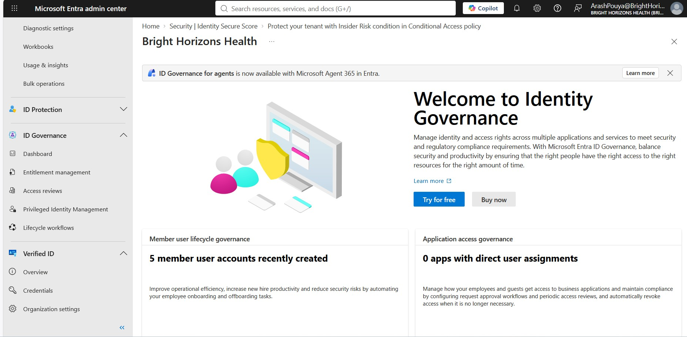

The project concentrated on four connected areas:

- **Entitlement Management** – packaging and governing access to resources.
- **Access Reviews** – periodically confirming that access remains justified.
- **PIM for Groups** – providing time-bound or Just-In-Time group membership and ownership.
- **Joiner, Mover and Leaver governance** – aligning access with changes in a person's business relationship.

---

# Module 1 – Identity Governance Foundations

Identity Governance addresses a broader question than ordinary user or group administration.

Traditional administration asks:

> How do I assign this permission?

Identity Governance also asks:

> Should this person still have the permission, why do they need it, who approved it, and when should it be removed?

This distinction became the foundation for the remaining modules.

Key governance principles considered throughout the project included:

- Principle of Least Privilege.
- Time-bound access.
- Approval and business justification.
- Periodic access recertification.
- Separation between normal business access and privileged access.
- Removal of access when the underlying business requirement ends.

---

# Module 2 – Guest and External Identities

Bright Horizons Health required a way to provide controlled access to an external consultant without creating a normal internal employee identity.

An external user, **Daniel**, was invited to the Bright Horizons Health tenant using Microsoft Entra B2B collaboration.

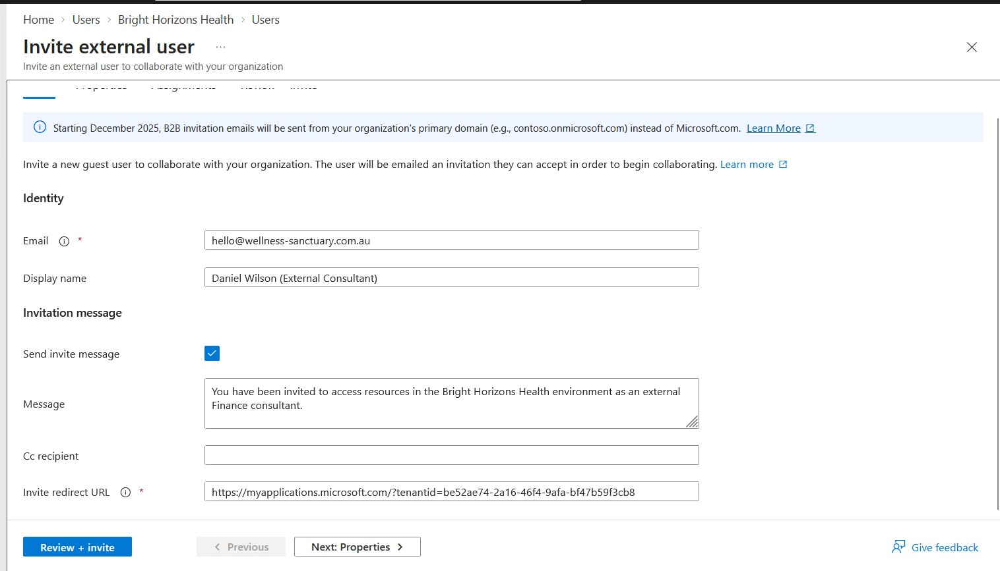

Daniel received the guest invitation through email.

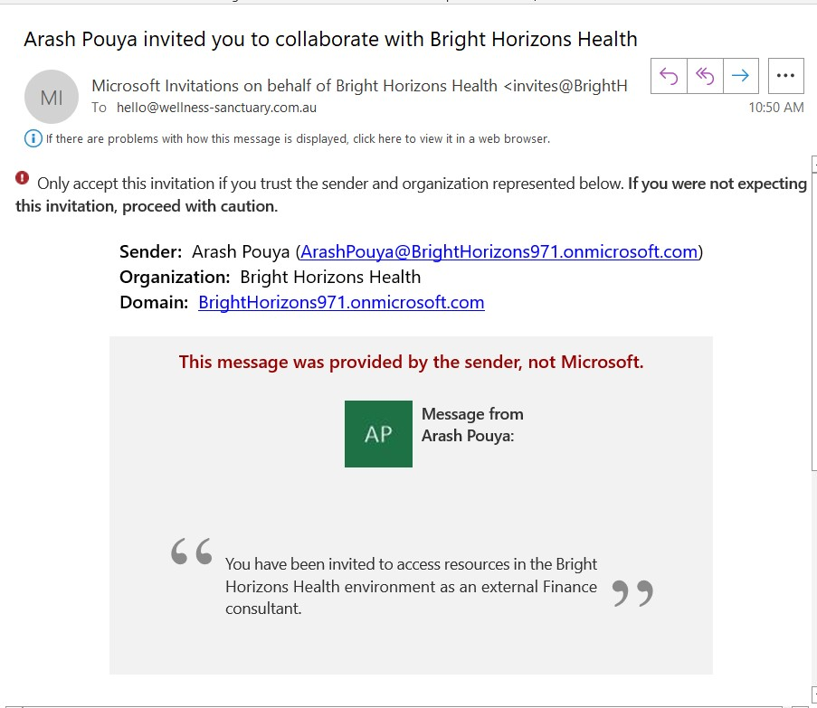

During authentication, email one-time passcode was used to validate the external identity.

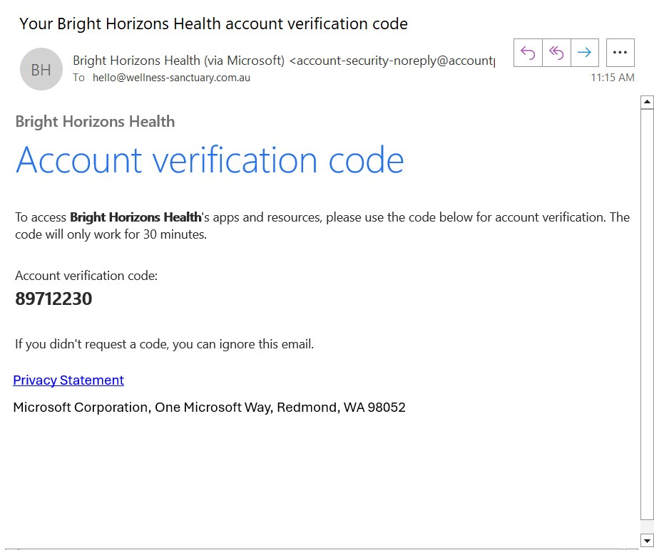

After accepting the invitation, Daniel appeared successfully as an external identity within the tenant.

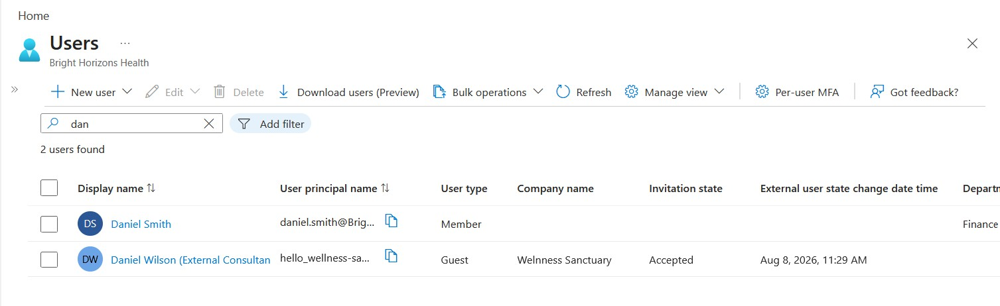

This demonstrated the basic B2B guest lifecycle and provided the external identity used for the Entitlement Management exercises.

---

# Module 3 – Entitlement Management and Access Packages

## Creating a Catalog

A catalog named for external consultant resources was created to organise the resources that could be governed through Entitlement Management.

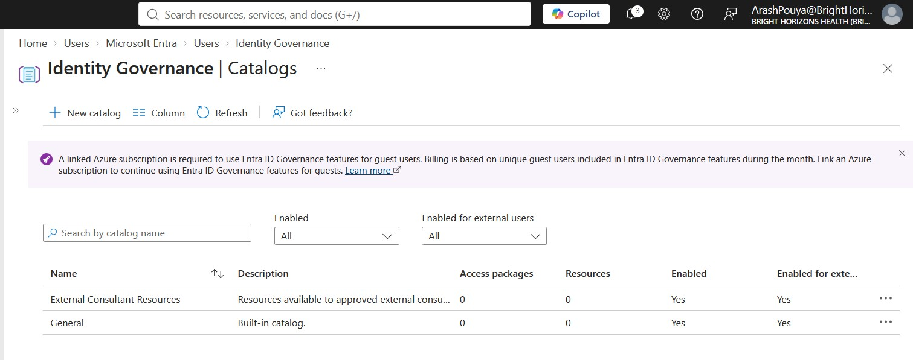

Relevant resources were then added to the catalog.

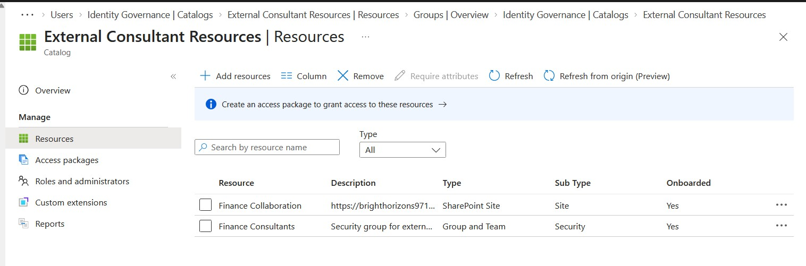

A useful distinction established during this module was:

**Catalog**  
→ contains resources that can be used for entitlement management.

**Access Package**  
→ bundles selected resource roles into a business-facing package.

**Assignment Policy**  
→ determines who can request the package, approval requirements and assignment lifecycle.

---

## Creating an Access Package

An access package was created to provide the external consultant with a governed bundle of resources rather than manually assigning each resource independently.

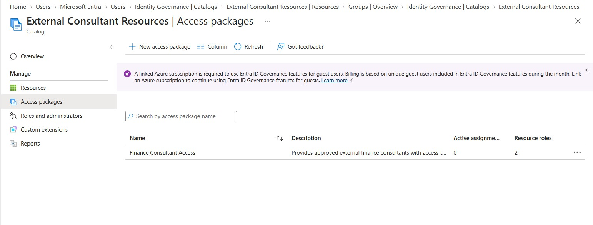

Access packages can contain resource roles from supported resources such as:

- Groups and Teams.
- Enterprise applications.
- SharePoint sites.

This makes an access package reusable for people performing the same business function rather than designing access separately for each individual.

---

## Request and Approval Workflow

Daniel requested access through the configured access package.

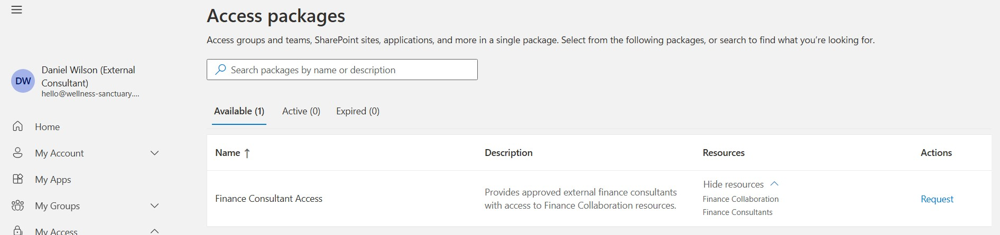

The request entered a pending approval state.

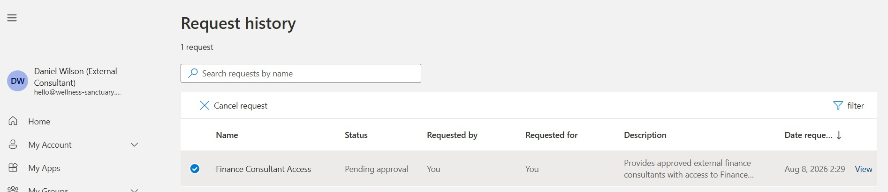

The designated approver received the request and could review the business justification before granting access.

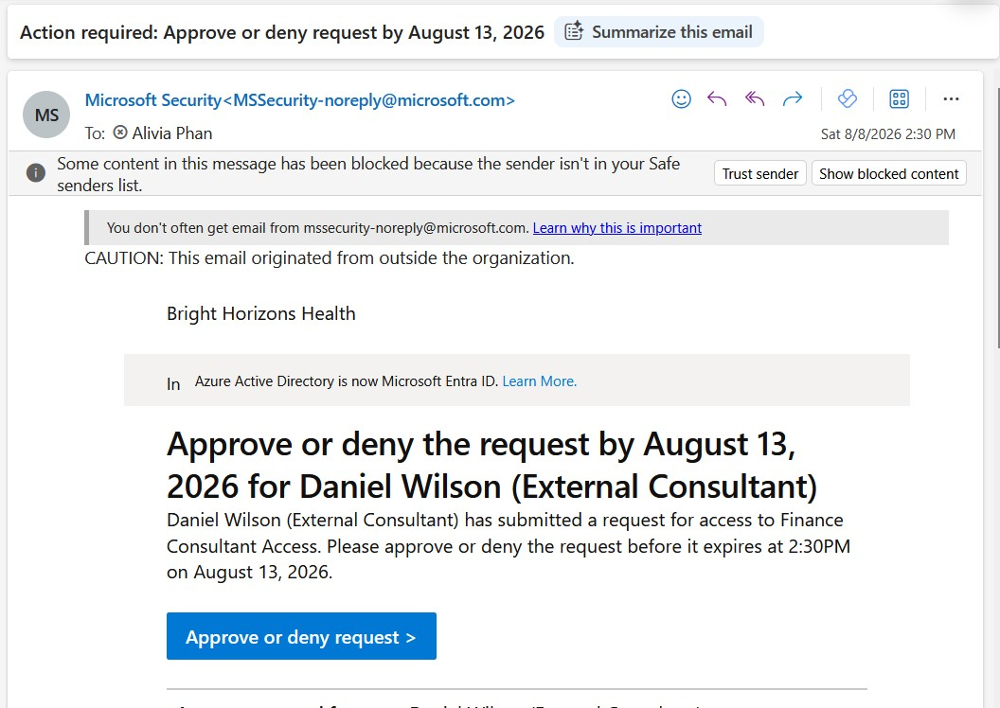

This demonstrated how Entitlement Management can introduce governance controls between a user's request and the actual delivery of resources.

---

## Assignment Delivery and Validation

After approval, the access package assignment was successfully delivered.

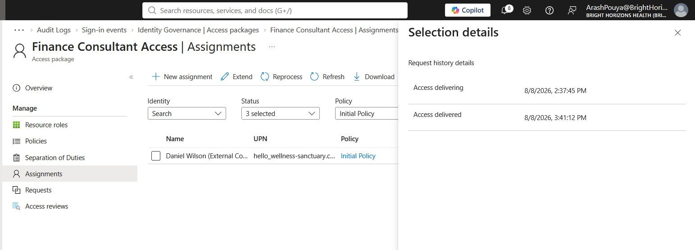

The external user was then able to access the intended SharePoint resource.

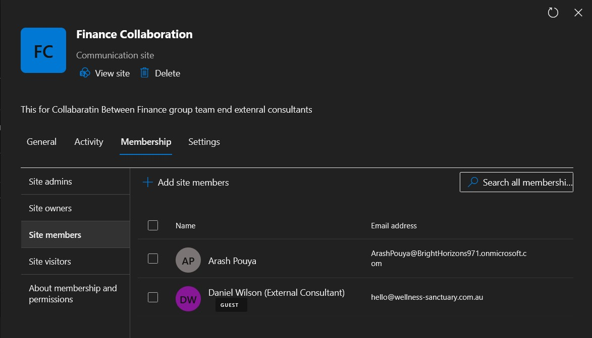

This validated the complete flow:

**External identity → request → justification → approval → access package assignment → resource provisioning → successful resource access**

During testing, SharePoint provisioning required troubleshooting before successful delivery was achieved. This reinforced the importance of validating the final user experience rather than assuming that an approved assignment automatically means every downstream resource has been provisioned successfully.

---

# Module 4 – Access Reviews

Access Reviews were explored as a mechanism for periodically verifying whether users should continue to retain access.

An Access Review was created for governed access within the tenant.

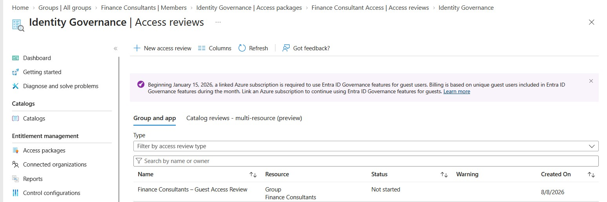

The reviewer experience was then tested.

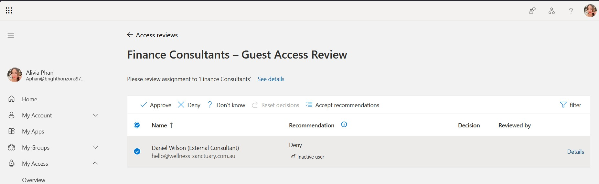

A review decision was submitted to confirm whether access should continue.

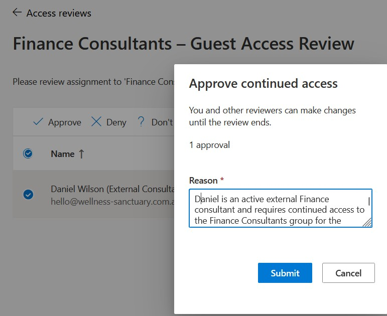

A key lesson from this module was the distinction between **reviewing access** and **enforcing the review result**.

If automatic application of results is not enabled, reviewer decisions provide governance evidence and recommendations but do not by themselves automatically remove access.

When automatic application is configured appropriately, review outcomes can be applied to the governed access.

Access Reviews therefore work well as a periodic recertification and detective/corrective control, but they should not replace proper Joiner, Mover and Leaver processes.

---

# Module 5 – PIM for Groups and Role-Assignable Groups

Project 07 used PIM to govern a direct Microsoft Entra administrator role assignment.

This module extended the concept by using **PIM for Groups** to govern membership in a **role-assignable security group**.

## Creating the Role-Assignable Group

A security group named **SG_PIM_UserAdmins** was created with Microsoft Entra role assignment enabled and the **User Administrator** role associated with the group.

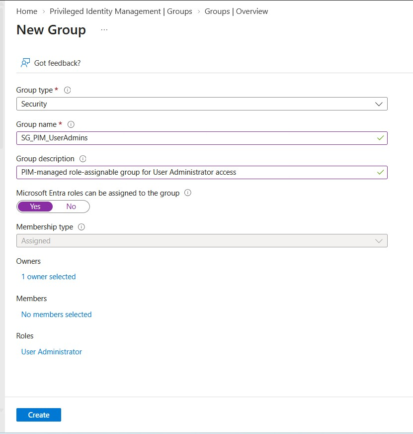

Role-assignable groups provide a scalable way to manage role assignment through controlled group membership.

Because of their privileged nature, role-assignable groups use additional security restrictions and cannot use dynamic membership.

---

## Eligible Group Membership

**Liam Young** was configured as an eligible Member of the role-assignable group through PIM for Groups.

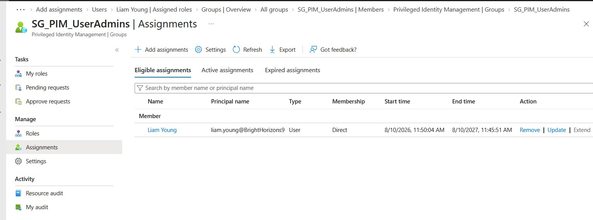

An eligible assignment does not make the user an active member immediately. Instead, it permits the user to activate membership when the privileged access is required.

Three assignment models were examined:

| PIM Assignment | Behaviour |
|----------------|-----------|
| Eligible | User is not currently a member and can activate membership when required. |
| Active – time-bound | User becomes a member immediately for a defined period and membership expires automatically. |
| Active – permanent | User remains an active member without an expiry. |

This distinction is useful because PIM can govern not only Just-In-Time membership but also temporary active membership where immediate access is required for a fixed period.

---

## Activating Group Membership

Liam requested activation of his eligible membership and provided a business justification.

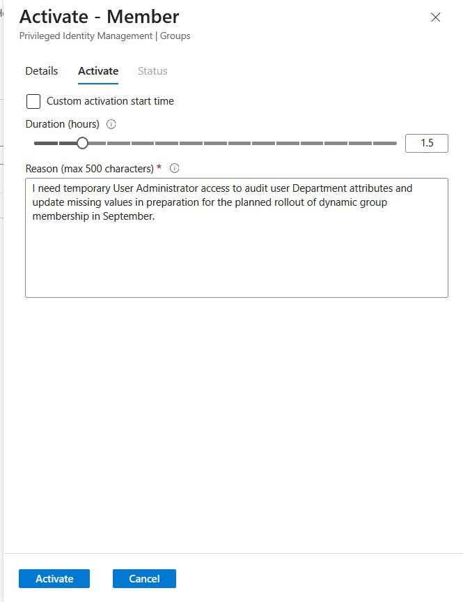

After activation, Liam appeared as an active member of **SG_PIM_UserAdmins**.

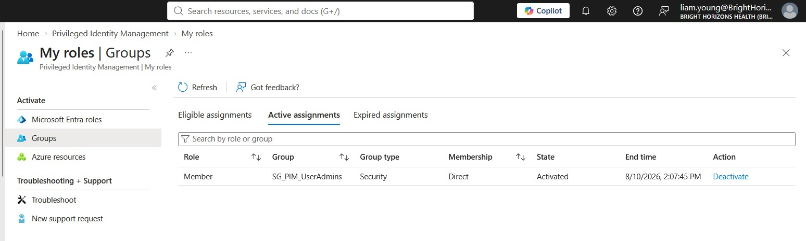

Because the group itself held the User Administrator role, Liam inherited that role while his group membership was active.

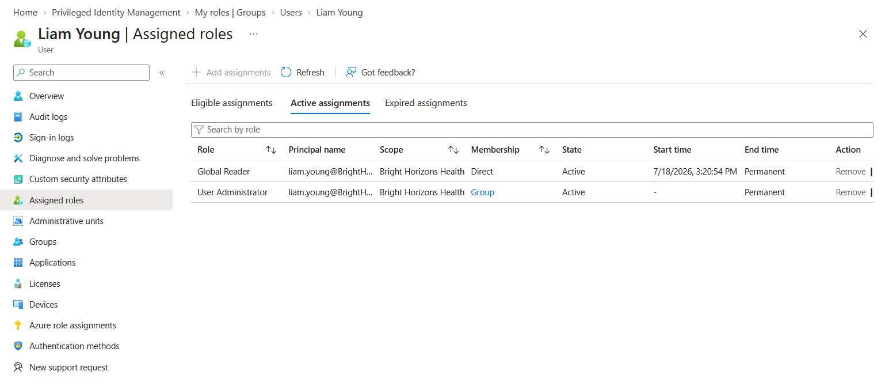

The complete privilege chain was therefore:

**Eligible user → activates group membership → becomes active group member → inherits User Administrator → activation expires → membership and inherited privilege are removed**

This provided a practical example of combining role-assignable groups with Just-In-Time privileged access.

---

## PIM for Groups Settings

Member activation settings were reviewed and modified to strengthen the activation process.

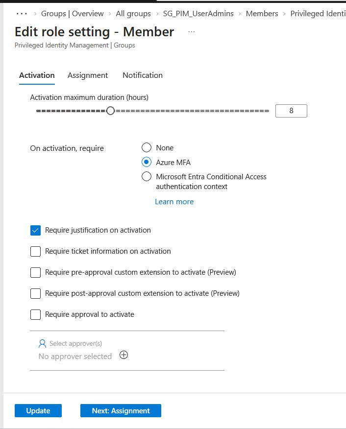

The configuration demonstrated that **Member** and **Owner** assignments can be governed separately.

Important controls considered included:

- Maximum activation duration.
- Multi-Factor Authentication.
- Business justification.
- Approval requirements.
- Eligible assignment duration.
- Active assignment duration.

An important practical lesson was that requiring MFA during PIM activation does not necessarily produce a new MFA prompt on every activation if strong authentication has already been satisfied in the current session. Where fresh reauthentication is required for sensitive activation, Conditional Access authentication context and appropriate reauthentication controls provide a stronger design. This will be explored further in the Conditional Access project.

---

# Module 6 – Joiner, Mover and Leaver Governance

Joiner, Mover and Leaver (JML) was explored as a governance model for ensuring access follows changes in a person's relationship with the organisation.

This module was **conceptual and scenario-based** rather than a hands-on Lifecycle Workflows implementation.

## Joiner

A Joiner process should ensure a new employee or external worker receives the access appropriate to their role without relying on informal administrator memory.

Some access may be standard role-based access, while additional temporary or governed resources may be provided through mechanisms such as Entitlement Management.

## Mover

A Mover process must consider both sides of a role change:

- What new access does the person require?
- What existing access is no longer justified?

Failing to remove obsolete access can result in **access accumulation or privilege creep**.

For example, when an employee moves from Finance to HR, simply adding HR access while retaining confidential Finance access is not sufficient governance.

## Leaver

A Leaver process should promptly prevent continued access when the person's business relationship ends.

Immediate containment can include blocking sign-in and revoking existing sessions. Governance cleanup should then address obsolete group memberships, access package assignments, privileged eligibility and other entitlements according to organisational policy.

Previously configured expiration dates should not be treated as a reason to leave access in place when the underlying business relationship has already ended.

---

## Lifecycle Workflows

Microsoft Entra Lifecycle Workflows were reviewed conceptually as a mechanism for automating identity lifecycle tasks associated with Joiner, Mover and Leaver events.

The lab licensing available during this project did not include hands-on Lifecycle Workflows configuration, so no claim of practical implementation is made in this project.

The key distinction is:

**JML is the governance/business process.**

**Lifecycle Workflows are one Microsoft Entra technology that can automate parts of that process.**

Access Reviews can provide an additional safety net by detecting access that should no longer exist, but periodic reviews should not replace an effective JML process.

---

# Module 7 – Production Scenario Design

The final module consolidated the technologies by applying them to realistic business requirements without selecting the Microsoft Entra feature in advance.

Several design patterns were identified.

## External Consultants

For external consultants requiring a bundle of project resources:

**Entitlement Management / Access Package**  
→ request and approval  
→ time-bound resource assignment  
→ periodic Access Review  
→ offboarding when the consultant leaves

Where a consultant additionally requires occasional administrative privilege:

**PIM**  
→ eligible least-privileged role  
→ controlled activation  
→ short activation duration  
→ privilege removed after use

---

## Permanent Role Change

When an employee permanently changes business roles:

**Mover/JML process**  
→ provision access required by the new role  
→ remove access no longer justified by the previous role

Access Reviews remain useful as a secondary control to detect anything missed by the primary mover process.

---

## Temporary Internal Project Access

An employee who remains in their normal department but temporarily joins a project does not necessarily need their underlying departmental access model changed.

A reusable **Access Package** can provide the additional project resources with approval and automatic expiration while leaving normal departmental access unchanged.

---

## Dynamic Groups vs Governed Project Access

Dynamic groups are appropriate when membership can be objectively determined from reliable attributes.

For example:

**department = Research → automatic Research group membership**

However, confidential project access requiring explicit request and approval is a different governance problem.

An important practical constraint identified during the project is that an Access Package cannot grant **Member** membership to a dynamic group because dynamic membership is controlled by the group's membership rule.

For governed project membership, an **assigned group** can therefore be more appropriate, allowing Entitlement Management to grant membership following request and approval.

---

# How the Governance Capabilities Fit Together

| Requirement | Appropriate Governance Mechanism |
|-------------|----------------------------------|
| Automatically group users based on attributes | Dynamic Groups |
| Provide a governed bundle of business resources | Entitlement Management / Access Packages |
| Control who may request access and require approval | Access Package Assignment Policy |
| Periodically verify whether access remains justified | Access Reviews |
| Provide temporary active privileged access | PIM |
| Provide Just-In-Time privileged group membership | PIM for Groups |
| Respond to employment/business lifecycle changes | Joiner / Mover / Leaver process |
| Automate identity lifecycle tasks | Lifecycle Workflows |
| Require fresh/strong authentication for sensitive access | Conditional Access / authentication controls |

The project demonstrated that Identity Governance is not about selecting one feature for every problem. Different controls address different stages and risks within the identity lifecycle.

---

# Validation and Troubleshooting

Practical validation was performed throughout the project rather than relying only on successful configuration screens.

Validation included:

- Confirming external invitation and authentication.
- Confirming B2B guest creation.
- Submitting an access package request as the external user.
- Reviewing and approving the request.
- Confirming successful access package assignment delivery.
- Validating actual SharePoint resource access.
- Performing Access Review decisions from the reviewer perspective.
- Activating eligible PIM group membership.
- Confirming active group membership.
- Confirming inherited User Administrator permissions through the role-assignable group.

A particularly useful troubleshooting exercise occurred during external SharePoint provisioning. The assignment did not initially represent a complete successful user experience, reinforcing the need to distinguish between:

**configuration success → provisioning success → actual end-user access**

This is an important operational principle when supporting identity and Microsoft 365 environments.

---

# Key Concepts Learned

During this project I gained practical experience or scenario-based understanding of:

- Microsoft Entra Identity Governance.
- Microsoft Entra B2B collaboration.
- Guest and external identities.
- Email one-time passcode authentication.
- Entitlement Management.
- Catalogs.
- Access Packages.
- Access Package resource roles.
- Assignment policies.
- Requestor scope.
- Business justification and approval.
- Time-bound entitlement assignment.
- Access Reviews.
- Reviewers and review decisions.
- Automatic application of review results.
- Role-assignable security groups.
- PIM for Groups.
- Eligible group membership.
- Active time-bound group membership.
- Member versus Owner governance.
- Inherited Entra roles through group membership.
- Joiner, Mover and Leaver governance.
- Access accumulation / privilege creep.
- Dynamic versus assigned group membership.
- Least privilege.
- Periodic access recertification.
- Production identity-governance design.

---

# Production Considerations

## Avoid Permanent Access Where the Business Need Is Temporary

Temporary consultants and project workers should not retain access indefinitely merely because access was once legitimately approved.

Where appropriate, assignment expiration and periodic reviews should be incorporated into the access lifecycle.

---

## Treat Access Reviews as a Secondary Control

Access Reviews are valuable for recertifying access and detecting inappropriate permissions.

However, organisations should not deliberately wait for the next quarterly review to remove access after a known role change or departure.

The Joiner, Mover and Leaver process should remain the primary lifecycle control.

---

## Separate Ordinary Access from Privileged Access

Normal business access and administrative privilege solve different requirements.

A Team Leader may require permanent access to ordinary operational resources while receiving sensitive administrator permissions only through an eligible PIM assignment.

---

## Design Reusable Entitlements Around Business Functions

Access Packages are more maintainable when designed around reusable business functions such as:

- External Cybersecurity Consultant.
- Clinical Project Member.
- Finance Transformation Project.

This is preferable to creating a unique package for every individual user.

---

## Use Dynamic Membership Only Where Attributes Determine Membership

Dynamic groups are effective for objective rules such as department or location.

They are less appropriate where membership requires explicit business approval.

The access mechanism should reflect the underlying business decision.

---

## Remove Access When the Business Justification Ends

An entitlement may have originally been approved for six or nine months, but a resignation, contract termination or project departure can end the business justification earlier.

The lifecycle process should remove the access when that event occurs rather than waiting for the original expiry date.

---

# Lessons Learned

This project demonstrated that effective Identity Governance requires more than configuring users, groups and permissions.

The most important lesson was to think about access as a **lifecycle**.

Access should be:

**requested or provisioned appropriately → approved where required → delivered → validated → periodically reviewed → removed when no longer justified**

Entitlement Management provides a structured method for governing bundles of business access, while Access Reviews provide ongoing recertification.

PIM for Groups extends Just-In-Time administration by making privileged group membership itself eligible and time-bound.

Joiner, Mover and Leaver governance connects these technical controls to changes in the person's real-world relationship with the organisation.

The production scenarios also reinforced that the correct design often involves combining multiple Microsoft Entra capabilities rather than trying to use one feature for every requirement.

---

# Conclusion

This project implemented and validated several Microsoft Entra Identity Governance capabilities within the Bright Horizons Health lab environment.

An external B2B identity was invited and authenticated, Entitlement Management was used to provide governed access through a catalog and access package, the complete request and approval lifecycle was validated, Access Reviews were configured and tested, and PIM for Groups was used to provide Just-In-Time membership of a role-assignable group with inherited User Administrator privileges.

The project then extended the hands-on work through Joiner, Mover and Leaver analysis and production scenarios covering external consultants, internal role changes, temporary project access, dynamic groups and privileged administration.

Together, these exercises demonstrated how Microsoft Entra can support controlled, time-bound and reviewable access across both standard and privileged identity scenarios.

---

# Next Steps

This project completed the core Microsoft Entra Identity Governance capabilities within the Bright Horizons Health lab.

The next stage of the Entra roadmap focuses on automation and operational administration through Microsoft Graph PowerShell.

**Project 09 – Microsoft Graph PowerShell & Entra Automation** will extend these governance concepts by replacing repetitive portal-based administration with scalable scripting and automation for users, groups, roles and identity management.

**Project 10 – Identity Health & Security Assessment** will then bring together governance, authentication and security controls in a production-style review of the tenant's identity posture.

A future advanced Identity Governance extension can also provide hands-on experience with **Lifecycle Workflows** when appropriate licensing is available.

